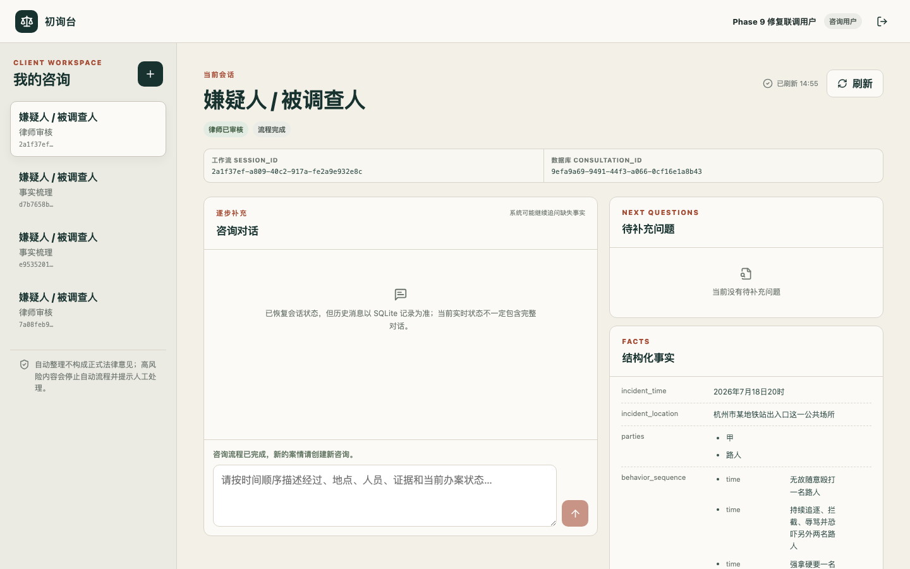
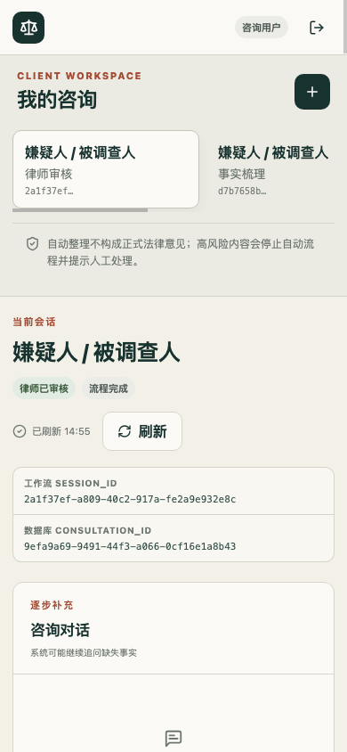
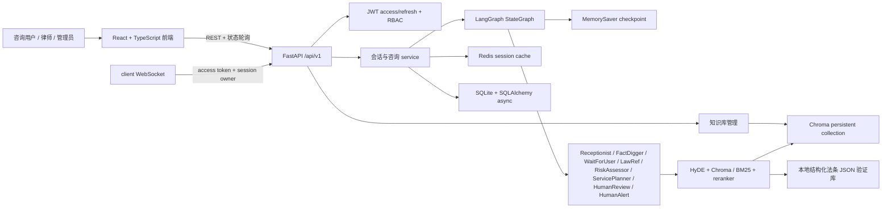
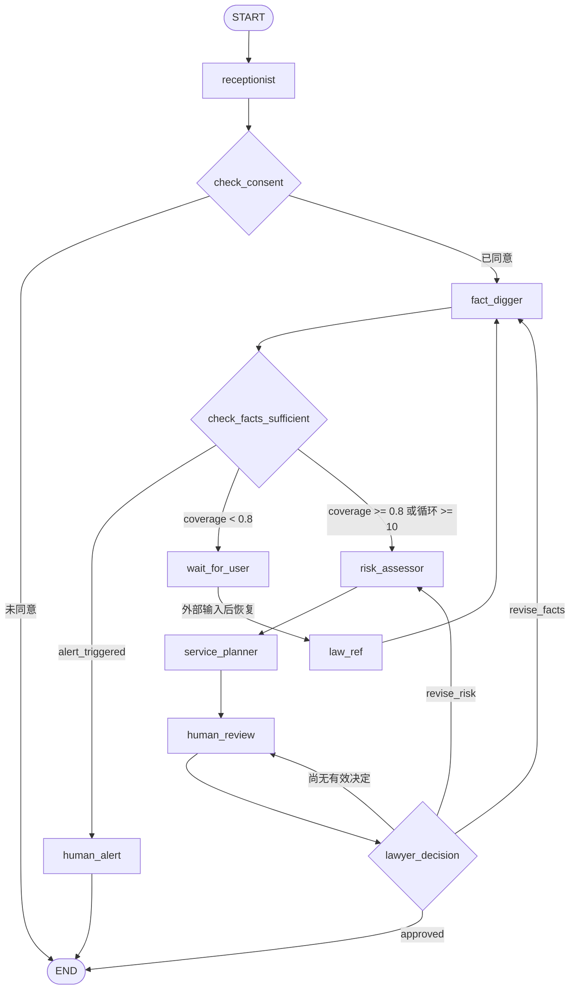
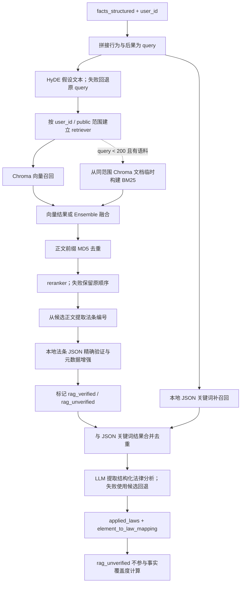

# Multi-Agent Criminal Defense Initial Consultation System

> 面向刑事辩护初期咨询的多 Agent AI 应用工程原型：用 LangGraph 把知情同意、结构化事实收集、法律资料检索、风险评估与律师审核编排成可中断、可恢复的工作流。

它不是自动出具法律意见的产品，而是一个用于展示 Agent 工作流、RAG 可靠性边界、后端权限与前端交互的可运行工程项目。

## 30 秒看懂项目

| 能力 | 当前实现 | 可核验证据 |
| --- | --- | --- |
| 多 Agent 编排 | 8 个 LangGraph 节点、条件边、`MemorySaver` checkpoint 和 4 个人工/用户中断点 | [workflow.py](backend/app/orchestrator/workflow.py) · [state](backend/app/state/consultation_state.py) |
| 结构化事实 | FactDigger 通过 Tool Calling 提取 10 类案件事实，并按法条构成要件覆盖度继续追问 | [fact_digger.py](backend/app/agents/fact_digger.py) · [extract_case_facts](backend/app/tools/fact_tools.py) |
| RAG 与法条验证 | HyDE、Chroma 向量检索、条件式 BM25 混合召回、reranker、JSON 法条验证与关键词补召回 | [rag_service.py](backend/app/rag/rag_service.py) · [hybrid_retriever.py](backend/app/rag/retrievers/hybrid_retriever.py) · [law_ref.py](backend/app/agents/law_ref.py) |
| Human-in-the-loop | 知情同意门禁、高风险转人工、律师批准或退回事实/风险节点 | [workflow.py](backend/app/orchestrator/workflow.py) · [human_alert.py](backend/app/agents/human_alert.py) |
| 应用后端 | FastAPI、JWT 双令牌、RBAC、SQLite async ORM、Redis 状态缓存、统一错误 envelope | [main.py](backend/main.py) · [JWT/RBAC](backend/app/security) · [v1 routes](backend/app/v1/router) |
| React 前端 | client 注册/登录、双 ID 会话、知情同意、消息与状态面板；lawyer/admin 审核工作台 | [frontend/src](frontend/src) · [前端测试](frontend/src/pages/ClientWorkspace.test.tsx) |
| 小型评估 | 30 条 input-only deterministic baseline，覆盖事实、法条关键词、高风险、追问、拒答和免责声明契约 | [cases.jsonl](evaluation/cases.jsonl) · [run_eval.py](evaluation/run_eval.py) |

## 真实界面

以下截图来自同一条本地虚构案件的真实 FastAPI + Redis + Ollama + Chroma + React 路径，不是 mock 或直接改写 workflow state。`session_id=2a1f37ef-a809-40c2-917a-fe2a9e932e8c`、`consultation_id=9efa9a69-9491-44f3-a066-0cf16e1a8b43` 自然经过结构化事实、RAG 候选法条、风险评估、ServicePlanner 报告草案与 HumanReview；管理员再分配律师，律师从前端调用 workflow review endpoint 批准，client 最终看到完成状态。它证明的是工程链路可运行，不代表模型输出具有法律正确性。

律师批准后的 client 完成态（桌面端 1440 × 900）：



同一完成态（移动端 390 × 844）：



早期 client 追问与结构化事实截图仍保留在 [assets/screenshots](assets/screenshots)，用于区分第一轮 MVP 证据与本次自然闭环证据。

## 系统架构



存储边界不是一套强一致事务：LangGraph checkpoint 在进程内，Redis 是会话缓存，SQLite 保存用户、咨询与 HTTP 消息等数据；完整 workflow state 目前不能仅靠 SQLite 恢复。

## LangGraph 工作流

源码拓扑定义在 [`ConsultationOrchestrator._build_workflow()`](backend/app/orchestrator/workflow.py)。



`receptionist`、`wait_for_user`、`human_review`、`human_alert` 执行后会中断。高风险分支到达 `END` 表示自动图停止，不表示外部律师工单或通知已发送。

## RAG 检索与验证流程



内置法条 JSON 是验证与规则补召回数据，不等于已填充的 Chroma 向量库。真实 RAG 还依赖可用的 embedding、已入库文档和本地 reranker；[`demos/rag/results/2026-07-14-ollama.json`](demos/rag/results/2026-07-14-ollama.json) 保存了一次 5 条查询的 live 子链记录，仅作运行证据，不是质量指标。

## 快速启动

### 前置条件

- Python `>=3.10`；统一 Make 入口默认用 `uv` 创建 Python 3.12 环境。
- Node.js、npm、Redis 7+。
- Ollama 本地模型，或可用的阿里云百炼兼容接口。

### Make 入口

```bash
cp backend/.env.example backend/.env
# 修改 JWT_SECRET_KEY，并选择 Ollama 或阿里云聊天 / embedding 配置

make install
redis-server              # 终端 1；当前后端启动硬依赖
make run-backend          # 终端 2：http://127.0.0.1:8000
make run-frontend         # 终端 3：http://127.0.0.1:5173
```

验证入口：

```bash
curl http://127.0.0.1:8000/health
# {"status":"healthy"}

make test                 # 定向后端回归 + 全部前端测试，不是完整 pytest
make eval                 # 30 条 deterministic baseline
```

### 通用 `uv` 后端环境

```bash
cd backend
cp .env.example .env
# 至少替换 JWT_SECRET_KEY，并配置 LLM / embedding
uv venv --python 3.12
uv pip install --python .venv/bin/python -r requirements.txt
.venv/bin/python main.py
```

前端可单独运行：

```bash
cd frontend
npm ci
npm run dev
```

配置模板见 [backend/.env.example](backend/.env.example)，统一命令见 [Makefile](Makefile)。

### 本地演示角色初始化

公开注册始终只能创建 `client`。本地演示如需 `admin` / `lawyer`，先用受控 CLI 初始化管理员，再由管理员调用既有 API 创建律师与分配案件；CLI 不接受命令行明文密码、要求显式本地确认，并拒绝 `APP_ENV=production`：

```bash
cd backend
read -s PHASE9_ADMIN_PASSWORD && export PHASE9_ADMIN_PASSWORD
.venv/bin/python -m examples.phase9_demo_admin \
  --confirm-local-demo \
  --username phase9_admin \
  --password-env PHASE9_ADMIN_PASSWORD
unset PHASE9_ADMIN_PASSWORD
```

管理员登录后使用 `POST /api/v1/lawyers/` 创建临时律师账号，再用 `POST /api/v1/consultations/assign` 提交 `consultation_id` 与 `lawyer_id`。两步均受 admin JWT 保护；演示密码只放在当前终端环境或无回显输入中，不写入仓库。律师主要审核动作使用 workflow `session_id` 调用 `PUT /api/v1/sessions/{session_id}/review`，不能用 SQLite-only 报告更新替代 LangGraph 恢复。

### 模型、数据与 Docker 边界

- Ollama 默认示例使用 `qwen3.5:0.8b` 和 `qwen3-embedding:0.6b`；阿里云模式需自行提供 key，不能把真实密钥写回仓库。
- SQLite 表由 lifespan 创建；Redis 连接失败会阻止后端启动。
- Chroma 初始可以为空，需通过知识库链路实际入库；健康检查不准备向量数据，也不调用 LLM。
- reranker 权重不随 Git 或 Docker 镜像分发；模型缺失或加载失败时保留原召回顺序。
- [docker-compose.yml](docker-compose.yml) 只包含 backend + Redis。Ollama / 阿里云、reranker 权重和前端均在 Compose 外。
- `docker compose config --quiet` 已验证；镜像 build、Compose up 和容器健康检查尚未完整验证，不能把配置校验视为部署成功。

## API 最小闭环

基础地址为 `http://127.0.0.1:8000/api/v1`，OpenAPI 页面为 `http://127.0.0.1:8000/docs`。

### 1. 注册与登录

公开注册只创建 `client`，不能通过请求体自助创建 `lawyer` 或 `admin`。

```bash
curl -X POST http://127.0.0.1:8000/api/v1/auth/register \
  -H 'Content-Type: application/json' \
  -d '{"username":"client1","password":"Passw0rd!","email":"client1@example.com","real_name":"测试用户"}'

curl -X POST http://127.0.0.1:8000/api/v1/auth/login \
  -H 'Content-Type: application/json' \
  -d '{"username":"client1","password":"Passw0rd!"}'
```

认证路由运行时成功响应使用 envelope：

```json
{
  "code": 200,
  "message": "success",
  "data": {
    "access_token": "<access_token>",
    "refresh_token": "<refresh_token>",
    "token_type": "bearer",
    "expires_in": 900,
    "user": {"id": "<user_id>", "role": "client"}
  }
}
```

把登录返回的 token 写入当前终端：

```bash
export ACCESS_TOKEN='<access_token>'
```

### 2. 创建 workflow 会话

```bash
curl -X POST http://127.0.0.1:8000/api/v1/sessions \
  -H "Authorization: Bearer $ACCESS_TOKEN" \
  -H 'Content-Type: application/json' \
  -d '{"user_type":"suspect","source":"readme"}'
```

`/sessions` 路由直接返回其 Pydantic response model，不包在 `data` 中：

```json
{
  "session_id": "<workflow_session_id>",
  "consultation_id": "<sqlite_consultation_id>",
  "welcome_message": "<权利义务告知>",
  "current_agent": "Receptionist",
  "created_at": "<ISO-8601>"
}
```

两个 ID 不能混用：

- `session_id`：LangGraph、Redis 和 `/sessions/{session_id}` 实时 workflow 路由使用。
- `consultation_id`：SQLite 咨询记录、历史和律师分配等数据库路由使用。

### 3. 知情同意与消息

```bash
export SESSION_ID='<workflow_session_id>'

curl -X POST "http://127.0.0.1:8000/api/v1/sessions/$SESSION_ID/confirm-consent" \
  -H "Authorization: Bearer $ACCESS_TOKEN" \
  -H 'Content-Type: application/json' \
  -d "{\"session_id\":\"$SESSION_ID\",\"consent_given\":true,\"consent_timestamp\":\"2026-07-16T08:00:00Z\",\"consent_version\":\"v1\",\"identity_info\":{\"role\":\"suspect\"}}"

curl -X POST "http://127.0.0.1:8000/api/v1/sessions/$SESSION_ID/message" \
  -H "Authorization: Bearer $ACCESS_TOKEN" \
  -H 'Content-Type: application/json' \
  -d "{\"session_id\":\"$SESSION_ID\",\"content\":\"事情发生在杭州，我和对方发生争执，对方先动手，我推了他一下。\",\"message_type\":\"text\"}"
```

核心权限边界：client 只能访问自己的会话；lawyer 只能访问已分配会话；admin 可管理用户、律师和知识库。律师审核使用 `PUT /api/v1/sessions/{session_id}/review`，可选择 `approved`、`revise_facts` 或 `revise_risk`。运行时错误统一为：

```json
{"error":{"code":"FORBIDDEN","message":"无权访问此会话"}}
```

部分历史成功路由仍返回 `{code,message,data}`，workflow `/sessions` 路由返回裸 response model；前端客户端同时兼容两种成功格式。自动生成的 422 OpenAPI schema 也可能仍显示 FastAPI 默认 `detail`，但运行时由全局处理器转换为 `error` envelope。

## Demo 与评估证据

### 可审计 Demo 资产

- [三条咨询 case 的数据契约](demos/consultation/README.md) 与 [普通伤害 case](demos/consultation/cases/ordinary_assault.json)：用于展示普通追问、事实不足和高风险转人工控制路径，不是真实案件。
- [确定性咨询 Demo runner](backend/examples/demo_complete.py) 与 [对应测试](backend/tests/demo/test_demo_complete.py)：固定节点输出会标记 `data_source=demo_fixture`，不冒充真实 RAG。
- [五条 RAG query](demos/rag/queries.json)、[历史失败记录](demos/rag/results/2026-07-13.json) 与 [Ollama live 记录](demos/rag/results/2026-07-14-ollama.json)：保留成功与失败条件，不能当作召回率或稳定性统计。

运行普通咨询 Demo：

```bash
cd backend
.venv/bin/python -m examples.demo_complete --case ordinary_assault
```

### 30 条 deterministic baseline

当前唯一活动评估入口是 [evaluation/run_eval.py](evaluation/run_eval.py)，输入为 [30 条固定 JSONL case](evaluation/cases.jsonl)，模式为 `offline-deterministic-baseline`。

| 指标 | 已有结果 |
| --- | ---: |
| 事实字段抽取覆盖 | 74 / 77（96.1%） |
| 法条关键词 hit@5 | 36 / 36（100.0%） |
| 高风险触发 | 30 / 30（100.0%） |
| 追问触发 | 29 / 30（96.7%） |
| 拒答触发 | 29 / 30（96.7%） |
| 免责声明 | 30 / 30（100.0%） |

这组结果只描述固定小样例中的确定性规则基线。runner 不调用真实 LLM、Ollama、Chroma、向量检索或 reranker，因此不能外推真实 LLM/RAG 准确率、开放输入表现或生产稳定性。历史 8 条 MVP 使用不同输入契约，也不与这组结果直接比较。

## 当前限制

- 本项目是工程原型，输出用于初步信息整理，不替代执业律师意见，也没有真实用户、线上业务或商业指标证据。
- `MemorySaver`、Redis、进程内状态和 SQLite 不是强一致存储；完整 workflow state 不从数据库恢复，WebSocket 消息也未写入 `consultation_messages`。
- Redis 是后端启动硬依赖；access token 没有服务端即时撤销列表。
- Chroma 默认空库，知识上传格式与模型依赖仍有边界；JSON 关键词匹配、法条编号抽取和 `rag_unverified` 候选都可能产生噪声。
- 已用一条修复后的虚构案件在同一后端进程内自然走到 HumanReview，并完成 admin 分配、真实 lawyer 前端批准和 client 完成态；演示账号由本地受控 CLI/API 临时创建，仓库不分发账号或密码。
- 本次自然运行中的候选法条、风险字段、费用占位和报告措辞是小模型草案，存在空值、占位与不可靠建议；截图只证明数据和审核链路，不构成法律质量评估。
- `PUT /sessions/{session_id}/review` 会完成活跃 workflow，但当前不会把最终文本、完成时间和状态强一致回写 SQLite consultation；服务重启后 `MemorySaver` checkpoint 和活跃队列不能恢复，Redis/SQLite 只读状态也不能继续执行该图。演示完整闭环必须在同一后端进程内完成。
- 当前测试入口采用定向后端回归和前端测试；历史完整 pytest 收集曾出现 `Killed: 9`，因此没有宣称全量测试、覆盖率或全部 Ruff 规则已通过。
- Compose 尚未取得完整 build/up/health 证据，也没有前端镜像、模型服务和 reranker 权重分发方案。

## 可迁移场景

下列是这套“结构化抽取 → 检索验证 → 条件路由 → 人工审核”架构可适配的方向，不是本仓库已经交付的产品：

- 企业知识库问答：将法条 JSON 验证替换为企业制度、产品或技术规范校验。
- 智能客服预审：用结构化 Tool Calling 收集工单要素，缺项时持续追问。
- 工单分流：把风险条件边替换为优先级、部门或 SLA 路由。
- 合规审核：对检索证据与规则库做双层验证，并保留人工批准门禁。
- 内部流程助手：复用 checkpoint、中断恢复、RBAC 和审计数据边界。

## 后续计划

1. 使用持久化 LangGraph checkpointer，并明确 SQLite、Redis 与 workflow state 的一致性及最终审核回写策略。
2. 完善知识库文档解析、向量库初始化与带版本的 RAG 评估集。
3. 增加 Alembic、容器 build/up smoke、前端部署与更细的失败场景测试。
4. 将 deterministic baseline 与固定模型/提示词/索引版本的 live LLM/RAG 评估分开报告。

## 代码入口

- [FastAPI 入口](backend/main.py)
- [LangGraph 工作流](backend/app/orchestrator/workflow.py)
- [Agent 节点](backend/app/agents)
- [RAG 服务](backend/app/rag)
- [API 路由](backend/app/v1/router)
- [React 前端](frontend/src)
- [Demo 资产](demos/README.md)
- [离线评估](evaluation/README.md)
- [部署配置](backend/.env.example)
- [LICENSE](LICENSE)

## License

本项目按 [MIT License](LICENSE) 开源。
