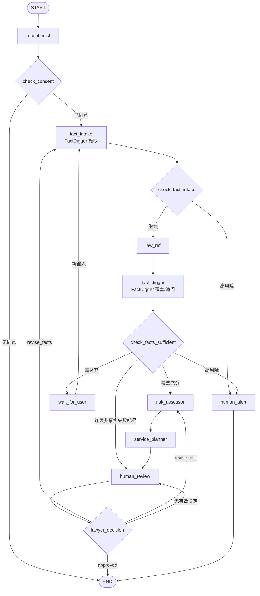

# 多 Agent 刑事辩护初期咨询系统

这是一个以 LangGraph 编排的刑事咨询工程原型，用于收集事实、检索法条候选、生成风险与服务草案，并在关键节点等待用户或律师操作。系统输出仅供辅助整理和人工复核，不能替代执业律师意见，也不保证法律适用、量刑或案件结果。

## 当前能力

| 能力 | 当前实现 | 代码入口 |
| --- | --- | --- |
| 多 Agent 编排 | 8 个工作流角色、9 个 LangGraph 执行节点、4 个中断点 | [`workflow.py`](backend/app/orchestrator/workflow.py) |
| 两阶段事实处理 | `fact_intake` 单次消费本轮输入，`fact_digger` 在法条检索后计算覆盖度 | [`fact_digger.py`](backend/app/agents/fact_digger.py) |
| 法条候选与覆盖 | RAG/关键词召回、来源枚举、权威 `required_elements` 覆盖契约 | [`law_ref.py`](backend/app/agents/law_ref.py) · [`law_schemas.py`](backend/app/schemas/law_schemas.py) |
| 有限失败恢复 | 连续 3 次 `no_law_match` 或 `dependency_failure` 后进入 `degraded` 并转 `HumanReview` | [`workflow.py`](backend/app/orchestrator/workflow.py) |
| 人工介入 | 知情同意、用户补充、律师审核、高风险短路 | [`workflow.py`](backend/app/orchestrator/workflow.py) |
| API 与前端 | FastAPI、JWT/RBAC、React + TypeScript + Vite | [`backend/main.py`](backend/main.py) · [`frontend/src`](frontend/src) |

## 工作流概览



`fact_intake` 与 `fact_digger` 是同一 FactDigger 角色的两个执行阶段。新消息先在 `fact_intake` 中完成高风险检测、脱敏和结构化事实刷新，随后 `law_ref` 基于新事实检索，最后 `fact_digger` 使用法条的权威要件计算覆盖度。`current_input` 成功摄取后立即清空；流程越过摄取节点后，恢复调用不会重新注入该一次性字段。

完整控制流见 [工作流说明](docs/workflow.md) 和 [架构说明](docs/architecture.md)。

## Clean-clone 数据边界

仓库刻意不发布以下运行时和私有内容：

- 新增的 SQLite、Chroma、MD5 记录、模型权重和上传资料；
- 真实 `.env`、密钥、日志、上传文件和运行时缓存；
- `.private/`、`.scratch/` 与本地 `AGENTS.md`；
- 带运行 UUID、账号或案件式可识别信息的截图。

当前提交树不再包含旧 DOCX 和 3 个派生 JSON：它们不是代码实际读取的运行时验证库，缺少来源/转换 manifest，且内容版本已经落后。代码期待 `backend/data/law_knowledge/criminal_law_chapters.json` 作为法条编号验证与关键词补召回数据，但 clean clone 不包含该文件，Docker 构建也明确排除整个 `backend/data/`。

缺少验证库时，RAG 候选不能升级为受信来源，JSON 关键词补召回也不可用；连续 3 次非事实失败后工作流会进入 `degraded` 并等待人工审核。旧文件仍可能存在于既有 Git 或远端历史；普通删除只清理当前提交树，不等于历史清除。任何历史改写都需要另行做 provenance 审计并取得明确授权，不得自动 force-push。详见 [RAG 边界](docs/rag.md)。

## 快速开始

前置条件：Python 3.10+、[`uv`](https://docs.astral.sh/uv/)、Node.js 20+、npm 和 Redis 7+。真实模型链还需要可访问的 Ollama 或兼容的云端接口。

```bash
make install
cp backend/.env.example backend/.env
```

编辑 `backend/.env`，至少替换 `JWT_SECRET_KEY`。不要把真实密钥提交到 Git，也不要把密码直接写入文档或 shell 命令。

启动 Redis 后，在两个终端运行：

```bash
make run-backend
make run-frontend
```

默认地址：

- 前端：`http://127.0.0.1:5173`
- 后端：`http://127.0.0.1:8000`
- OpenAPI：`http://127.0.0.1:8000/docs`

详细配置见 [安装与启动](docs/setup.md)。

## 验证

项目采用风险拆分的定向验证；历史上完整 pytest 收集曾被系统以 `Killed: 9` 终止，因此不要把某个定向分组外推为全量测试结论。

```bash
make test
npm --prefix frontend run typecheck
npm --prefix frontend run build
make eval
```

工作流 P0 契约可用以下公开环境中立命令验证：

```bash
cd backend
.venv/bin/python -m pytest -q \
  tests/agents/test_fact_digger.py \
  tests/agents/test_law_ref.py \
  tests/orchestrator/test_workflow.py \
  tests/orchestrator/test_workflow_degraded.py \
  tests/orchestrator/test_workflow_example.py \
  tests/orchestrator/test_workflow_minimal.py \
  tests/integration/test_data_flow.py
```

验证范围和历史数字的解释边界见 [测试说明](docs/testing.md) 与 [离线评估](docs/evaluation.md)。

## Docker Compose

Compose 仅包含 backend 与 Redis；Docker build context 排除了 `backend/data/`，因此镜像不包含法条来源文件、运行时验证库、Chroma 内容或模型权重：

```bash
make compose-config
make compose-up
curl http://127.0.0.1:8000/health
make compose-down
```

镜像可构建不代表真实 RAG 已可用；运行时验证库、模型和索引仍需单独准备并核验。

## 文档

- [安装与启动](docs/setup.md)
- [系统架构](docs/architecture.md)
- [LangGraph 工作流](docs/workflow.md)
- [API 与权限边界](docs/api.md)
- [RAG 与法条来源边界](docs/rag.md)
- [确定性 Demo](docs/demo.md)
- [测试说明](docs/testing.md)
- [离线评估](docs/evaluation.md)
- [失败场景与限制](docs/limitations.md)

## 安全与法律声明

- 系统不得用于规避侦查、毁灭证据、串供或其他违法活动。
- 高风险检测只是有限规则，不是紧急服务、自动报案或外部律师工单。
- 新增或替换法条数据前必须完成来源、许可、版本和转换 manifest 核验。
- 报告草案必须经过有权限的律师复核后才可作为后续工作的参考。

## License

[MIT](LICENSE)
