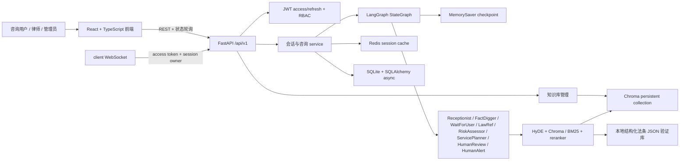
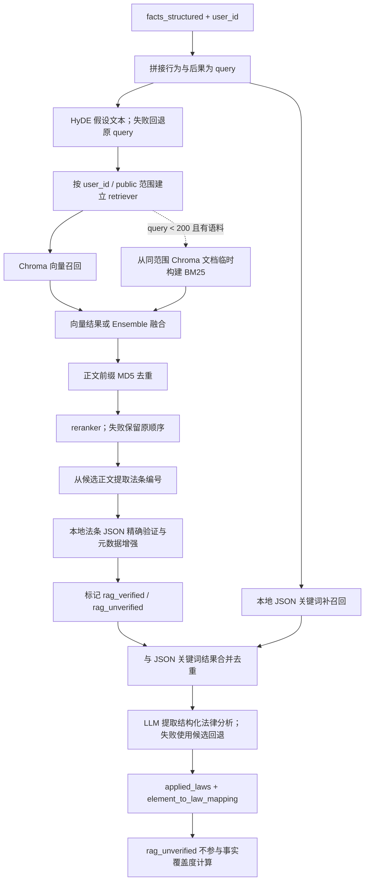

# Multi-Agent Criminal Defense Initial Consultation System

> 面向刑事辩护初期咨询的多 Agent AI 应用工程原型：用 LangGraph 把知情同意、结构化事实收集、法律资料检索、风险评估与律师审核编排成可中断、可恢复的工作流。

它不是自动出具法律意见的产品，而是一个用于展示 Agent 工作流、RAG 可靠性边界、后端权限与前端交互的可运行工程项目。

## 30 秒看懂项目

| 能力 | 当前实现 | 可核验证据 |
| --- | --- | --- |
| 多 Agent 编排 | 8 个 LangGraph 节点、条件边、`MemorySaver` checkpoint 和 4 个人工/用户中断点 | [workflow.py](backend/app/orchestrator/workflow.py) · [state](backend/app/state/consultation_state.py) |
| 结构化事实 | FactDigger 通过 Tool Calling 提取 10 类案件事实，并按法条构成要件覆盖度继续追问 | [fact_digger.py](backend/app/agents/fact_digger.py) · [extract_case_facts](backend/app/tools/fact_tools.py) |
| RAG 与法条验证 | HyDE、Chroma 向量检索、条件式 BM25 混合召回、reranker、JSON 法条验证与关键词补召回 | [rag_service.py](backend/app/rag/rag_service.py) · [hybrid_retriever.py](backend/app/rag/retrievers/hybrid_retriever.py) · [law_ref.py](backend/app/agents/law_ref.py) |
| Human-in-the-loop | 知情同意门禁、高风险转人工、律师批准或退回事实/风险节点 | [workflow.py](backend/app/orchestrator/workflow.py) · [human_alert.py](backend/app/agents/human_alert.py) |
| 应用后端 | FastAPI、JWT 双令牌、RBAC、SQLite async ORM、Redis 状态缓存、统一错误 envelope | [main.py](backend/main.py) · [JWT/RBAC](backend/app/security) · [v1 routes](backend/app/v1/router) |
| React 前端 | client 注册/登录、双 ID 会话、知情同意、消息与状态面板；lawyer/admin 审核工作台 | [frontend/src](frontend/src) · [前端测试](frontend/src/pages/ClientWorkspace.test.tsx) |
| 小型评估 | 30 条 input-only deterministic baseline，覆盖事实、法条关键词、高风险、追问、拒答和免责声明契约 | [cases.jsonl](evaluation/cases.jsonl) · [run_eval.py](evaluation/run_eval.py) |

## 真实界面

以下截图来自同一条本地虚构案件的真实 FastAPI + Redis + Ollama + Chroma + React 路径，不是 mock 或直接改写 workflow state。`session_id=2a1f37ef-a809-40c2-917a-fe2a9e932e8c`、`consultation_id=9efa9a69-9491-44f3-a066-0cf16e1a8b43` 自然经过结构化事实、RAG 候选法条、风险评估、ServicePlanner 报告草案与 HumanReview；管理员再分配律师，律师从前端调用 workflow review endpoint 批准，client 最终看到完成状态。它证明的是工程链路可运行，不代表模型输出具有法律正确性。

律师批准后的 client 完成态（桌面端 1440 × 900）：


同一完成态（移动端 390 × 844）：


早期 client 追问与结构化事实截图仍保留在 [assets/screenshots](assets/screenshots)，用于区分第一轮 MVP 证据与本次自然闭环证据。

## 系统架构



存储边界不是一套强一致事务：LangGraph checkpoint 在进程内，Redis 是会话缓存，SQLite 保存用户、咨询与 HTTP 消息等数据；完整 workflow state 目前不能仅靠 SQLite 恢复。

## LangGraph 工作流

源码拓扑定义在 [`ConsultationOrchestrator._build_workflow()`](backend/app/orchestrator/workflow.py)。


`receptionist`、`wait_for_user`、`human_review`、`human_alert` 执行后会中断。高风险分支到达 `END` 表示自动图停止，不表示外部律师工单或通知已发送。

## RAG 检索与验证流程



内置法条 JSON 是验证与规则补召回数据，不等于已填充的 Chroma 向量库。真实 RAG 还依赖可用的 embedding、已入库文档和本地 reranker；[`demos/rag/results/2026-07-14-ollama.json`](demos/rag/results/2026-07-14-ollama.json) 保存了一次 5 条查询的 live 子链记录，仅作运行证据，不是质量指标。

## 快速启动

下面是两条独立路径。两条路径先完成同一份配置与模型准备，再分别启动服务，最后按“初始化 Chroma”与“分层就绪检查”验证真实咨询所需依赖；`/health` 成功只说明 FastAPI 进程可响应，不说明 LLM、embedding、Chroma 或 reranker 可用。

### 两条路径共享：配置与模型准备

项目声明 Python `>=3.10`；为了让公开 Make 入口可复现，`Makefile` 默认由 `uv` 管理 Python 3.12。本地开发路径使用该 3.12 环境；`Dockerfile` 构建的 backend 镜像使用 Python 3.12，不要求宿主机另装 Python 或 `uv`。需要本地环境时，从 [Astral 官方安装页](https://docs.astral.sh/uv/getting-started/installation/) 安装 `uv`。

从仓库根目录复制配置，并生成 JWT secret。输出只粘贴到已忽略的 `backend/.env`，不要提交真实密钥：

```bash
cp backend/.env.example backend/.env
openssl version
openssl rand -hex 32
# 用输出替换 backend/.env 中的 JWT_SECRET_KEY
```

默认 Ollama 路径保留模板中的 `LLM_TYPE="OLLAMA"` 与 `EMBED_MODEL_TYPE="OLLAMA"`。先安装 Ollama 桌面应用或 CLI，并运行 `ollama --version` 确认可用。随后启动桌面应用；只使用 CLI 时，在单独终端运行以下服务并保持该终端开启：

```bash
ollama serve
```

确认服务已启动后，在另一个终端拉取并检查两个精确模型：

```bash
ollama pull qwen3.5:0.8b
ollama pull qwen3-embedding:0.6b
curl -fsS http://127.0.0.1:11434/api/tags
```

如改用阿里云，把 `LLM_TYPE`、`EMBED_MODEL_TYPE` 改为 `ALIYUN`，填写 `ALIYUN_ACCESS_KEY_SECRET` 及对应模型配置；不要把真实 key 写入仓库。配置字段以 [backend/.env.example](backend/.env.example) 为准。

### 路径 A：本地开发

需要 `uv`、Node.js/npm、Redis 7+，以及共享步骤中选择的模型服务。`uv` 负责安装并选择项目使用的 Python 3.12；先确认命令可用：

```bash
uv --version
uv python install 3.12
uv python find 3.12
node --version
npm --version
redis-server --version
```

安装后端与前端依赖：

```bash
make install
```

然后使用三个终端启动；当前后端 lifespan 把 Redis 作为硬依赖，Redis 不可用时后端不会完成启动：

```bash
# 终端 1
redis-server

# 终端 2（仓库根目录）
make run-backend

# 终端 3（仓库根目录）
make run-frontend
```

也可以只用通用 `uv` 命令准备后端环境：

```bash
cd backend
uv venv --python 3.12
uv pip install --python .venv/bin/python -r requirements.txt
.venv/bin/python -m uvicorn main:app --host 127.0.0.1 --port 8000
```

### 路径 B：Docker 后端 + 宿主机前端/Ollama

[docker-compose.yml](docker-compose.yml) 只启动 `backend` 与 `redis`。前端仍在容器外运行；使用 Ollama 时，Ollama 也运行在宿主机，Compose 将后端地址覆盖为 `http://host.docker.internal:11434`。该路径不需要宿主机 Python 或 `uv`；完整界面才需要 Node.js/npm。完成共享配置与模型准备后，从仓库根目录执行：

```bash
docker --version
docker compose version
docker compose config --quiet
docker compose up --build -d
docker compose ps
curl -fsS http://127.0.0.1:8000/health
```

按需查看最近日志：

```bash
docker compose logs --tail=100 backend redis
```

如需持续观察，再单独运行 `docker compose logs -f backend redis`；按 `Ctrl-C` 只会停止观察，不会停止容器。

需要完整界面时，在另一个宿主机终端启动 Compose 外的前端：

```bash
npm --prefix frontend ci
npm --prefix frontend run dev -- --host 127.0.0.1 --port 5173
```

宿主机先检查 Ollama API 和两个模型：

```bash
curl -fsS http://127.0.0.1:11434/api/tags
curl -fsS http://127.0.0.1:11434/api/tags | grep -F 'qwen3.5:0.8b'
curl -fsS http://127.0.0.1:11434/api/tags | grep -F 'qwen3-embedding:0.6b'
```

Compose 已运行时，再从 backend 容器检查宿主机连通性：

```bash
docker compose exec backend python -c \
  "import urllib.request; print(urllib.request.urlopen('http://host.docker.internal:11434/api/tags', timeout=5).status)"
```

只有当容器访问宿主机 Ollama 失败时，才考虑用 `OLLAMA_HOST=0.0.0.0:11434 ollama serve` 重新启动服务；这会扩大监听范围，应同时限制本机防火墙和网络暴露。它不是所有平台默认必需的设置。

### Reranker 与持久化边界

reranker 权重不在 Git 或 Docker 镜像中。当前正常 app/RAG 路径不会自动调用 `check_and_download_model()`；首次 rerank 只会懒加载 `RERANKER_MODEL_PATH`。推荐在真实 RAG 演示前显式预下载，以下命令需要能够访问 ModelScope。

本地路径（先完成 `make install`）：

```bash
cd backend
.venv/bin/python -c \
  'from app.rag.reranker import RerankerConfig; from app.rag.reorder_service import check_and_download_model; print(check_and_download_model(RerankerConfig.from_env()))'
test -f data/models/Qwen/Qwen3-Reranker-0.6B/config.json
cd ..
```

Docker 路径（Compose 保持运行）：

```bash
docker compose exec backend python -c \
  'from app.rag.reranker import RerankerConfig; from app.rag.reorder_service import check_and_download_model; print(check_and_download_model(RerankerConfig.from_env()))'
docker compose exec backend test -f \
  /app/runtime/models/Qwen/Qwen3-Reranker-0.6B/config.json
```

下载函数使用 `RerankerConfig.from_env()`，把模型写入本地 `backend/data/models`，或写入 Compose 映射到 `backend-runtime` 的 `/app/runtime/models`。命令输出下载路径且上述 `config.json` 检查成功，表示权重文件已就位；首次真实 rerank 后还应在 backend 日志中确认“模型加载成功”。如果不下载，或下载/加载失败，app 仍可启动，RAG 会保留原召回顺序并以“无 reranker”降级运行。运行真实 RAG 演示前应明确记录当前是完整排序还是该降级路径。本仓库仍未把容器内下载或加载写成 fresh 已验证事实。

持久化分工如下：

- `backend-runtime`：SQLite、Chroma、MD5 记录、reranker/model cache。
- `redis-data`：Redis AOF 数据。
- Ollama 模型和前端依赖：不在 Compose 命名卷内。

新建的 `backend-runtime` 是空卷；换机器需要重新下载或迁移模型，并单独迁移需要保留的命名卷数据。重新 build 镜像不会自动补齐 Chroma；`docker compose down -v` 会删除本地命名卷及其中运行数据，不要把它当作普通重启命令。

### 初始化 Chroma 公共知识库

新卷或新的本地数据目录中，Chroma 默认可能为空。先启动后端并准备好 embedding 服务，再用受控 CLI 创建本地 demo admin。公开注册只能创建 `client`；CLI 会无回显询问至少 8 位密码，不接受命令行明文密码，并拒绝 `APP_ENV=production`。

本地 `.venv` 路径：

```bash
cd backend
.venv/bin/python -m examples.phase9_demo_admin \
  --confirm-local-demo \
  --username readme_admin
cd ..
```

Docker 路径（Compose 已运行）：

```bash
docker compose exec backend python -m examples.phase9_demo_admin \
  --confirm-local-demo \
  --username readme_admin
```

登录时由 Python 标准库 `getpass` 无回显读取密码，再由 `json.dumps` 序列化请求；双引号、反斜杠及换行等 JSON 特殊字符会被正确转义，明文也不会进入 shell history。命令不创建密码环境变量。

本地 `.venv` 路径：

```bash
backend/.venv/bin/python -c '
import getpass, json, urllib.request
payload = json.dumps({"username": "readme_admin", "password": getpass.getpass("Admin password: ")}).encode()
request = urllib.request.Request("http://127.0.0.1:8000/api/v1/auth/login", data=payload, headers={"Content-Type": "application/json"})
print(urllib.request.urlopen(request).read().decode())
'
```

Docker 路径（Compose 保持运行）：

```bash
docker compose exec backend python -c '
import getpass, json, urllib.request
payload = json.dumps({"username": "readme_admin", "password": getpass.getpass("Admin password: ")}).encode()
request = urllib.request.Request("http://127.0.0.1:8000/api/v1/auth/login", data=payload, headers={"Content-Type": "application/json"})
print(urllib.request.urlopen(request).read().decode())
'
```

成功响应是 `{"code":200,"message":"success","data":{"access_token":"...",...}}`。从 `data.access_token` 复制 access token，再无回显写入当前终端变量：

```bash
read -s ADMIN_ACCESS_TOKEN
export ADMIN_ACCESS_TOKEN
echo
```

从仓库根目录把跟踪的法条 JSON 作为 multipart 字段 `file` 上传为公共文档，然后检查列表：

```bash
curl -fsS -X POST \
  'http://127.0.0.1:8000/api/v1/knowledge/add/single?is_public=true' \
  -H "Authorization: Bearer $ADMIN_ACCESS_TOKEN" \
  -F 'file=@backend/data/刑法_formatted.json;type=application/json'

curl -fsS http://127.0.0.1:8000/api/v1/knowledge/list \
  -H "Authorization: Bearer $ADMIN_ACCESS_TOKEN"
```

上传成功 envelope 的 `code` 为 `200`；列表响应为 `{"code":200,"message":"success","data":{"documents":[...],"total_count":...}}`。只有 `data.total_count > 0` 才能说明该 admin 可见的 Chroma 文档列表非空；`/health` 不会创建向量、调用 embedding 或证明 RAG 可用。

如还需 `lawyer` 角色，管理员可使用 `POST /api/v1/lawyers/` 创建临时律师账号，再用 `POST /api/v1/consultations/assign` 提交 `consultation_id` 与 `lawyer_id`。律师主要审核动作使用 workflow `session_id` 调用 `PUT /api/v1/sessions/{session_id}/review`，不能用 SQLite-only 报告更新替代 LangGraph 恢复。

### 分层就绪检查

按顺序确认每层，而不是只看单个绿色状态。以下模型检查针对默认 Ollama 路径；阿里云路径应改为实际聊天与 embedding 调用验证，不能用 `/health` 代替：

```bash
# 1. FastAPI
curl -fsS http://127.0.0.1:8000/health

# 2. Redis：本地路径；Docker 路径另看 redis 是否 healthy
redis-cli ping
docker compose ps

# 3. Ollama API 与两个模型
curl -fsS http://127.0.0.1:11434/api/tags
curl -fsS http://127.0.0.1:11434/api/tags | grep -F 'qwen3.5:0.8b'
curl -fsS http://127.0.0.1:11434/api/tags | grep -F 'qwen3-embedding:0.6b'

# 4. Reranker：任选当前路径检查权重；缺失时可继续，但必须记录为降级
test -f backend/data/models/Qwen/Qwen3-Reranker-0.6B/config.json
docker compose exec backend test -f \
  /app/runtime/models/Qwen/Qwen3-Reranker-0.6B/config.json

# 5. Chroma：复用上一步得到的 admin access token，确认 total_count > 0
curl -fsS http://127.0.0.1:8000/api/v1/knowledge/list \
  -H "Authorization: Bearer $ADMIN_ACCESS_TOKEN"

# 6. Compose 外的前端
curl -I http://127.0.0.1:5173
```

默认 Ollama 路径只有在 FastAPI、Redis、Ollama 两个模型、非空 Chroma 列表和前端都就绪，并明确记录 reranker 是完整排序还是降级后，才运行真实咨询/RAG/律师审核演示；阿里云路径须用对应上游调用验证替代 Ollama 两项。通用验证入口仍是：

```bash
make test  # 定向后端回归 + 全部前端测试，不是完整 pytest
make eval  # 30 条 deterministic baseline，不调用真实 LLM/RAG
```

### 常见故障

- `uv: command not found`：先安装 `uv` 并重新执行版本检查；不要改用未确认版本的 Python 环境。
- 后端停在启动阶段或报 Redis 连接错误：Redis 是当前 lifespan 的硬依赖；本地启动 `redis-server`，Docker 查看 `docker compose ps` 与 `docker compose logs redis`。
- 容器无法访问 Ollama：先验证宿主机 `/api/tags`，再执行容器内 `host.docker.internal` 检查；仅失败时考虑前述 `OLLAMA_HOST` 排障。
- Ollama 返回 model not found：重新执行两个精确的 `ollama pull`，并在 `/api/tags` 中分别确认模型名。
- reranker 下载或加载失败：查看 backend 日志；当前设计会保留原召回顺序，但这只是降级，不代表排序质量等价。
- `/health` 正常但无 RAG 结果：检查 embedding 模型和 `knowledge/list`；空 Chroma 不会被健康检查发现。
- 端口占用：用 `lsof -nP -iTCP:8000 -iTCP:5173 -iTCP:6379 -iTCP:11434` 确认冲突进程，再选择停止冲突服务或显式改端口。
- volume 重建后数据消失：`backend-runtime` 与 `redis-data` 是本机 Docker 数据；删除命名卷或换机器前应先做迁移/备份，镜像与 Git 不包含这些运行数据。

当前历史部署证据只确认 Compose 配置解析；没有 fresh 的镜像 build、`compose up`、容器健康和真实 LLM/RAG 全链结果时，不能写成“完整 Docker 部署已验证”。统一命令见 [Makefile](Makefile)。

## API 最小闭环

基础地址为 `http://127.0.0.1:8000/api/v1`，OpenAPI 页面为 `http://127.0.0.1:8000/docs`。

### 1. 注册与登录

公开注册只创建 `client`，不能通过请求体自助创建 `lawyer` 或 `admin`。

```bash
curl -X POST http://127.0.0.1:8000/api/v1/auth/register \
  -H 'Content-Type: application/json' \
  -d '{"username":"client1","password":"Passw0rd!","email":"client1@example.com","real_name":"测试用户"}'

curl -X POST http://127.0.0.1:8000/api/v1/auth/login \
  -H 'Content-Type: application/json' \
  -d '{"username":"client1","password":"Passw0rd!"}'
```

认证路由运行时成功响应使用 envelope：

```json
{
  "code": 200,
  "message": "success",
  "data": {
    "access_token": "<access_token>",
    "refresh_token": "<refresh_token>",
    "token_type": "bearer",
    "expires_in": 900,
    "user": {"id": "<user_id>", "role": "client"}
  }
}
```

把登录返回的 token 写入当前终端：

```bash
export ACCESS_TOKEN='<access_token>'
```

### 2. 创建 workflow 会话

```bash
curl -X POST http://127.0.0.1:8000/api/v1/sessions \
  -H "Authorization: Bearer $ACCESS_TOKEN" \
  -H 'Content-Type: application/json' \
  -d '{"user_type":"suspect","source":"readme"}'
```

`/sessions` 路由直接返回其 Pydantic response model，不包在 `data` 中：

```json
{
  "session_id": "<workflow_session_id>",
  "consultation_id": "<sqlite_consultation_id>",
  "welcome_message": "<权利义务告知>",
  "current_agent": "Receptionist",
  "created_at": "<ISO-8601>"
}
```

两个 ID 不能混用：

- `session_id`：LangGraph、Redis 和 `/sessions/{session_id}` 实时 workflow 路由使用。
- `consultation_id`：SQLite 咨询记录、历史和律师分配等数据库路由使用。

### 3. 知情同意与消息

```bash
export SESSION_ID='<workflow_session_id>'

curl -X POST "http://127.0.0.1:8000/api/v1/sessions/$SESSION_ID/confirm-consent" \
  -H "Authorization: Bearer $ACCESS_TOKEN" \
  -H 'Content-Type: application/json' \
  -d "{\"session_id\":\"$SESSION_ID\",\"consent_given\":true,\"consent_timestamp\":\"2026-07-16T08:00:00Z\",\"consent_version\":\"v1\",\"identity_info\":{\"role\":\"suspect\"}}"

curl -X POST "http://127.0.0.1:8000/api/v1/sessions/$SESSION_ID/message" \
  -H "Authorization: Bearer $ACCESS_TOKEN" \
  -H 'Content-Type: application/json' \
  -d "{\"session_id\":\"$SESSION_ID\",\"content\":\"事情发生在杭州，我和对方发生争执，对方先动手，我推了他一下。\",\"message_type\":\"text\"}"
```

核心权限边界：client 只能访问自己的会话；lawyer 只能访问已分配会话；admin 可管理用户、律师和知识库。律师审核使用 `PUT /api/v1/sessions/{session_id}/review`，可选择 `approved`、`revise_facts` 或 `revise_risk`。运行时错误统一为：

```json
{"error":{"code":"FORBIDDEN","message":"无权访问此会话"}}
```

部分历史成功路由仍返回 `{code,message,data}`，workflow `/sessions` 路由返回裸 response model；前端客户端同时兼容两种成功格式。自动生成的 422 OpenAPI schema 也可能仍显示 FastAPI 默认 `detail`，但运行时由全局处理器转换为 `error` envelope。

## Demo 与评估证据

### 可审计 Demo 资产

- [三条咨询 case 的数据契约](demos/consultation/README.md) 与 [普通伤害 case](demos/consultation/cases/ordinary_assault.json)：用于展示普通追问、事实不足和高风险转人工控制路径，不是真实案件。
- [确定性咨询 Demo runner](backend/examples/demo_complete.py) 与 [对应测试](backend/tests/demo/test_demo_complete.py)：固定节点输出会标记 `data_source=demo_fixture`，不冒充真实 RAG。
- [五条 RAG query](demos/rag/queries.json)、[历史失败记录](demos/rag/results/2026-07-13.json) 与 [Ollama live 记录](demos/rag/results/2026-07-14-ollama.json)：保留成功与失败条件，不能当作召回率或稳定性统计。

运行普通咨询 Demo：

```bash
cd backend
.venv/bin/python -m examples.demo_complete --case ordinary_assault
cd ..
```

### 30 条 deterministic baseline

当前唯一活动评估入口是 [evaluation/run_eval.py](evaluation/run_eval.py)，输入为 [30 条固定 JSONL case](evaluation/cases.jsonl)，模式为 `offline-deterministic-baseline`。

| 指标 | 已有结果 |
| --- | ---: |
| 事实字段抽取覆盖 | 74 / 77（96.1%） |
| 法条关键词 hit@5 | 36 / 36（100.0%） |
| 高风险触发 | 30 / 30（100.0%） |
| 追问触发 | 29 / 30（96.7%） |
| 拒答触发 | 29 / 30（96.7%） |
| 免责声明 | 30 / 30（100.0%） |

这组结果只描述固定小样例中的确定性规则基线。runner 不调用真实 LLM、Ollama、Chroma、向量检索或 reranker，因此不能外推真实 LLM/RAG 准确率、开放输入表现或生产稳定性。历史 8 条 MVP 使用不同输入契约，也不与这组结果直接比较。

## 停止服务

完成上方连通性检查、API 闭环和所需 Demo 后，再清理当前终端中的临时 token/ID。Docker 路径从仓库根目录停止 backend 与 Redis，但保留命名卷：

```bash
unset ADMIN_ACCESS_TOKEN ACCESS_TOKEN SESSION_ID
docker compose down
```

本地开发路径分别在 FastAPI、Redis 和前端终端按 `Ctrl-C`。前端与 Ollama 不属于 Compose；Docker 路径如启动了宿主机前端或 `ollama serve`，也需在各自终端停止，或退出 Ollama 桌面应用。

## 限制、安全边界与改进方向

- 本项目是工程原型：输出用于初步信息整理和律师审核前草案，不替代执业律师意见，不能承诺法律适用、量刑、程序或案件结果。30 条评估是固定 input-only deterministic baseline，不调用真实 LLM、Ollama、Chroma 或 reranker；一次同进程的 Ollama/Chroma 自然链只证明工程路径曾跑通，不代表法律正确性或生产稳定性。
- 事实覆盖低于 `0.8` 会追问，循环最多 10 次；这能限制无限等待，却不能证明短输入、待鉴定证据或多人多行为叙述已经查明。`FactDigger` 对已覆盖的特定要件做保守规则，但尚无事件图、跨主体一致性或证据来源校验。[事实覆盖实现](backend/app/agents/fact_digger.py)
- RAG 候选先经本地法条 JSON 验证；`rag_unverified` 不参与覆盖度计算，但“已验证”也不等于个案结论。向量库、embedding、关键词回退、编号抽取和 rerank 仍可能漏召回、误召回或排序不当。[LawRef 验证路径](backend/app/agents/law_ref.py)
- 模型输出可能空缺、不稳定或含占位；RiskAssessor 解析失败会保留“待评估/待确认”默认结构，而非给出可信风险结论。人工审核仍是必要断点。[风险降级](backend/app/agents/risk_assessor.py) · [审核断点](backend/app/orchestrator/workflow.py)
- 已有免责声明、知情同意门禁、PII 正则脱敏、高风险转人工和律师审核路径：FactDigger 在写入 `facts_raw` 前脱敏；高风险规则会进入 HumanAlert，HTTP/WS 暴露告警。但规则可能误报/漏报，脱敏并未构成端到端数据治理，HumanAlert 没有已证实的外部工单/通知闭环；通用“拒答”目前只在离线 baseline 中实现，不是主运行时统一策略。[安全过滤](backend/app/security/sensitive_filter.py) · [HumanAlert](backend/app/agents/human_alert.py) · [离线拒答基线](evaluation/run_eval.py)
- `MemorySaver`、进程内活跃队列、Redis 与 SQLite 不是强一致状态系统。律师批准的 workflow 完成态不会强一致回写 SQLite consultation；服务重启后不能由 Redis/SQLite 继续执行原图。当前没有完整容器 build/up/health、线上监控、容量或成本证据，不能表述为生产部署能力。[状态同步](backend/app/v1/service/consultation_service.py)

优先改进顺序是：先用持久化 checkpoint 和一致性回写补齐恢复能力，并把拒答/人工转交/模型失败处理做成共享运行时策略；再以更大、版本化的评估集验证 rerank、检索和事件图；最后在现有 client owner、assigned lawyer、admin 校验基础上继续细化案件/字段/动作级授权，补 access token 即时撤销、角色或禁用变化的及时生效、审核轨迹与最小权限，并建设脱敏可观测性、成本统计及前端对草案、降级和不可恢复状态的明确展示。

## 可迁移场景

下列是这套“结构化抽取 → 检索验证 → 条件路由 → 人工审核”架构可适配的方向，不是本仓库已经交付的产品：

- 企业知识库问答：将法条 JSON 验证替换为企业制度、产品或技术规范校验。
- 智能客服预审：用结构化 Tool Calling 收集工单要素，缺项时持续追问。
- 工单分流：把风险条件边替换为优先级、部门或 SLA 路由。
- 合规审核：对检索证据与规则库做双层验证，并保留人工批准门禁。
- 内部流程助手：复用 checkpoint、中断恢复、RBAC 和审计数据边界。

## 后续计划

1. 使用持久化 LangGraph checkpointer，并明确 SQLite、Redis 与 workflow state 的一致性及最终审核回写策略。
2. 完善知识库文档解析、向量库初始化与带版本的 RAG 评估集。
3. 增加 Alembic、容器 build/up smoke、前端部署与更细的失败场景测试。
4. 将 deterministic baseline 与固定模型/提示词/索引版本的 live LLM/RAG 评估分开报告。

## 代码入口

- [FastAPI 入口](backend/main.py)
- [LangGraph 工作流](backend/app/orchestrator/workflow.py)
- [Agent 节点](backend/app/agents)
- [RAG 服务](backend/app/rag)
- [API 路由](backend/app/v1/router)
- [React 前端](frontend/src)
- [Demo 资产](demos/README.md)
- [离线评估](evaluation/README.md)
- [部署配置](backend/.env.example)
- [LICENSE](LICENSE)

## License

本项目按 [MIT License](LICENSE) 开源。
