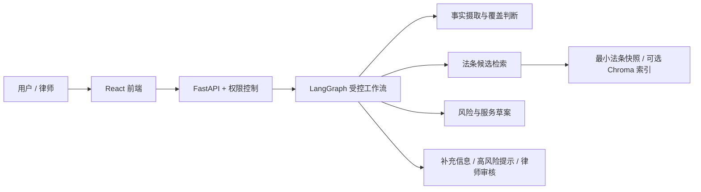

# 刑事辩护初期咨询：受控 Agentic Workflow

一个以 LangGraph 编排的刑事咨询工程原型：收集案件事实、检索法条候选、整理风险与服务草案，并在关键节点等待用户补充或律师复核。它是 **Workflow with LLM Nodes**，不是由多个自主 Agent 独立决策的法律服务。

> 这是工程展示与辅助整理工具，不提供法律意见；法律适用、量刑和案件结果必须由执业律师结合完整材料判断。

## 项目亮点

- **人机协作的可控流程**：事实摄取、法条检索、覆盖判断、风险与服务草案由显式条件边编排；知情同意、信息补充、高风险提示和律师审核设有人工控制点。
- **有来源边界的法律检索**：将法条候选与构成要件覆盖关联；仓库仅提供六条经版本与来源核对的最小验证快照，不将项目标注冒充官方法律解释。
- **可解释的失败处理**：模型产物经过结构化校验；超时、依赖失败和连续无法匹配会进入受控降级或人工复核路径，而不是默默生成成功结果。
- **工程化接口与观测**：FastAPI、JWT/RBAC、React 前端，以及会话命令的串行/幂等边界、调用树和预算记录。默认 checkpoint、锁、幂等缓存及观测数据仍是单进程范围。
- **分层验证**：测试、确定性离线 baseline 和独立的真实模型链路试跑各有入口；它们的结果与限制分别记录，不混作法律质量指标。

## 系统概览



主流程、状态权威和失败路由见 [工作流说明](docs/workflow.md) 与 [架构说明](docs/architecture.md)。

## 快速开始

需要 Python 3.10+、`uv`、Node.js 20+、npm 和 Redis 7+。真实模型路径还需自行配置可访问的 Ollama 或兼容接口；详细环境、模型准备和 Docker Compose 步骤见 [安装与启动](docs/setup.md)。

```bash
make install
cp backend/.env.example backend/.env
```

配置 `backend/.env` 中的 `JWT_SECRET_KEY`，启动 Redis，然后分别运行 `make run-backend` 和 `make run-frontend`。默认前端位于 `http://127.0.0.1:5173`，API 文档位于 `http://127.0.0.1:8000/docs`。不要提交真实密钥、上传资料或运行数据。

## 验证与边界

公开的最小法条快照只覆盖《刑法》第 232、234、263、264、266、293 条；不包含完整法条库、预建 Chroma 索引、模型权重或真实案件材料。离线 30 例 baseline 不调用真实 LLM；现有三例真实链路回归到达 `wait_for_user`，但未完成咨询闭环，不能据此声称法律准确率或生产可用性。详见 [RAG 与数据来源](docs/rag.md)、[评估说明](docs/evaluation.md) 和 [测试说明](docs/testing.md)。

## 文档导航

| 主题 | 文档 |
| --- | --- |
| 安装、本地运行与 Docker Compose | [安装与启动](docs/setup.md) |
| 系统组成、状态与工作流 | [架构](docs/architecture.md) · [工作流](docs/workflow.md) |
| API、检索与数据边界 | [API](docs/api.md) · [RAG](docs/rag.md) |
| Demo、测试与评估 | [Demo](docs/demo.md) · [测试](docs/testing.md) · [评估](docs/evaluation.md) |
| 已知失败场景和限制 | [限制](docs/limitations.md) |

系统不得用于规避侦查、毁灭证据、串供或其他违法活动；高风险提示不是紧急服务或自动报案。报告草案须经有权限的律师复核后，方可作为后续工作的参考。

## License

[MIT](LICENSE)
