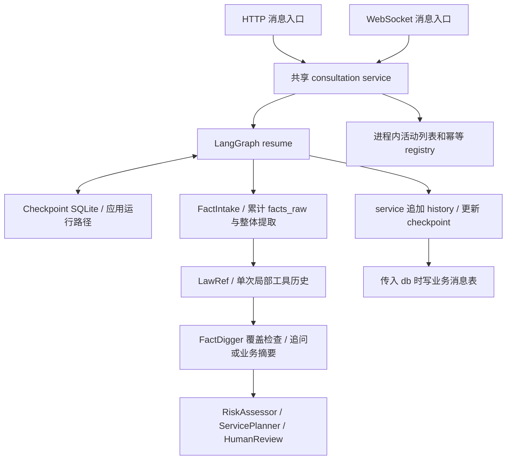

# 2026-10-02 Agent Memory / Context Management 实施前分析

> 历史快照：本文描述 2026-10-02 第一阶段实施前状态，后续实现已部分取代其中判断；技术分析、测试数字和探针结果保持原貌。当前职责以 [Memory 主说明](../../memory/README.md) 为准。本页已归档，源码行号保留当时引用，可能随实现演进失效。

分析日期：2026-10-02。范围：当前工作树的第一阶段只读分析与验证；本阶段没有修改业务代码，没有实现新的 memory subsystem。

## 结论

当前系统具备**持久化工作流状态和按已知会话 ID 恢复执行位置**的基础。应用启动已经配置真实的 `AsyncSqliteSaver`；独立构造 orchestrator 时默认仍是进程内 `MemorySaver`。不能把默认构造方式的限制套到应用运行方式上。

当前缺少的是：完整且统一的原始对话记录、调用前的 Agent 上下文预算、滚动对话摘要，以及带来源和冲突处理的结构化案件记忆。已有 `facts_structured` 可以跨轮保存，但更新方式是重新提取并整体替换；它不具备可靠的增量事实记忆契约。

**并非每个 Agent 每轮都发送全部 `conversation_history`。** 明确累计发送的是 FactDigger 的全部 `facts_raw`，以及 LawRef 单次研究调用内的局部工具历史。应分别治理这两条输入增长链路。

## 一、实现清单

以下链接指向当前代码；行号用于定位，代码演进后应重新核对。

| 主题 | 实现位置 | 当前职责 |
| --- | --- | --- |
| LangGraph State | [state.py](../../../backend/app/consultation/state.py#L7) | `ConsultationState` 共享事实、历史、产物、身份和控制字段；没有 `add_messages` reducer 或独立 memory schema |
| 图、checkpoint、恢复 | [workflow.py](../../../backend/app/consultation/workflow.py#L443) | saver 注入、编译、中断、按 `snapshot.next` 恢复、状态投影和进程内活动列表 |
| 应用持久化初始化 | [main.py](../../../backend/main.py#L38) | 启动时打开 checkpoint SQLite、安装 `AsyncSqliteSaver`；`/ready` 报告持久化能力声明 |
| 会话服务和历史累计 | [service.py](../../../backend/app/consultation/service.py#L611) | 会话串行、幂等、resume、追加用户/回复历史、可选业务消息入库 |
| 业务 SQLite | [db.py](../../../backend/app/infrastructure/database/db.py#L14)、[consultation.py](../../../backend/app/models/consultation.py#L21) | 咨询记录、workflow ID 映射、消息审计；不是图执行位置来源 |
| HTTP / WS / 历史入口 | [routes.py](../../../backend/app/api/v1/routers/consultation/routes.py#L50)、[websocket.py](../../../backend/app/api/v1/routers/consultation/websocket.py#L178)、[consultation_history.py](../../../backend/app/api/v1/routers/consultation_history.py#L94) | 创建、消息、同意、审核、关闭、列表和业务消息查询；记录行为不完全一致 |
| 律师兼容入口 | [lawyer.py](../../../backend/app/api/v1/routers/lawyer.py#L32) | 旧接口 ID 适配、审核、业务表读取、人工接管 |
| 接待和事实提取 | [receptionist.py](../../../backend/app/consultation/agents/receptionist.py#L112)、[fact_digger.py](../../../backend/app/consultation/agents/fact_digger.py#L487) | 接待 prompt、累计事实提取、追问、面向咨询者的事实摘要 |
| 事实 schema / 工具 | [artifacts.py](../../../backend/app/consultation/schemas/artifacts.py#L34)、[fact_tools.py](../../../backend/app/consultation/tools/fact_tools.py#L1)、[fact_data.py](../../../backend/app/consultation/fact_data.py#L1) | 事实产物格式校验、解析通道、字段访问；没有事实来源链或冲突版本 |
| 法律 Agent 和工具上下文 | [law_ref.py](../../../backend/app/consultation/agents/law_ref.py#L242)、[legal_research.py](../../../backend/app/consultation/agents/legal_research.py#L379) | 按结构化事实检索；单次调用维护 AI/Tool 历史，导出研究审计概要 |
| 下游上下文 | [risk_assessor.py](../../../backend/app/consultation/agents/risk_assessor.py#L117)、[service_planner.py](../../../backend/app/consultation/agents/service_planner.py#L181) | 事实、法条、风险产物以及有限历史字段拼接 |
| Prompt 来源 | [prompt.yaml](../../../backend/app/config/prompt.yaml#L1)、[prompts.py](../../../backend/app/infrastructure/config/prompts.py#L38) | 文件注册与读取；LawRef 主流程另外使用代码中的 prompt 常量 |
| LLM 消息构造 | [gateway.py](../../../backend/app/infrastructure/llm/gateway.py#L268)、[factory.py](../../../backend/app/infrastructure/llm/factory.py#L275) | Gateway 每次构造输入消息；Factory 缓存模型实例，不保存聊天记忆 |
| 调用 / token 统计 | [tracing.py](../../../backend/app/infrastructure/observability/tracing.py#L262) | 进程内会话调用计数、事后 usage 累计和成本估算 |
| RAG 与文档摘要 | [rag_service.py](../../../backend/app/knowledge/rag/rag_service.py#L343)、[vector_store.py](../../../backend/app/knowledge/rag/vector_store.py#L93) | 法律文档检索、用户文档过滤、文档摘要；不是 Agent 案件记忆库 |
| 检索侧局部预算 | [full_law_retrieval.py](../../../backend/app/knowledge/full_law_retrieval.py#L187)、[full_law_reranker.py](../../../backend/app/knowledge/full_law_reranker.py#L55) | HyDE 输出与重排 query/document 长度约束；不等于 Agent prompt 预算 |
| 既有验证 | [test_checkpoint_persistence.py](../../../backend/tests/consultation/test_checkpoint_persistence.py#L73)、[run_eval.py](../../../evaluation/run_eval.py#L35)、[run_live_eval.py](../../../evaluation/run_live_eval.py#L383)、[run_full_eval.py](../../../evaluation/run_full_eval.py#L44) | checkpoint 契约、单输入 baseline、组件/检索评估；没有完整多轮 memory eval |

## 二、第一阶段要求的直接回答

### 1. 当前一次多轮对话如何保存？

存在三种不同的数据，不应互相替代：

- `current_input`：本轮一次性输入；resume 在事实摄取前写 checkpoint，成功消费后清空。
- `facts_raw`：FactIntake 累计的案件陈述，经过 `sanitize_input` 脱敏；不包含完整助手对话。字段注释中的“未经处理”与真实实现不一致。
- `conversation_history`：用户/Agent 回复配对与节点内部事件混合的列表；没有统一消息结构、稳定消息 ID 或轮次序号。

正常消息成功执行图后，service 把原始用户内容和 `final_output` 配成一项追加到 history，再显式更新 checkpoint。正常 HTTP 另写业务 SQLite 消息表；WS 没有传 `db`，不经过该消息入库分支。两种存储之间没有共同事务。见 [service.py](../../../backend/app/consultation/service.py#L735)、[HTTP 调用](../../../backend/app/api/v1/routers/consultation/routes.py#L171)、[WS 调用](../../../backend/app/api/v1/routers/consultation/websocket.py#L204)。

### 2. 是否把全部历史 messages 不断累积并重新发送给模型？

history 和事实列表会累计，但模型输入按节点分别构造。FactDigger 每次事实提取拼接全部 `facts_raw`，达标摘要也使用全部陈述；RiskAssessor、LawRef 等主要使用结构化事实。LawRef 另外在一次研究内累计工具反馈。具体输入见第四节；不能把这些情况概括为“所有 Agent 每轮发送全部聊天历史”。

### 3. checkpoint 当前保存了什么？

LangGraph saver 保存图状态、checkpoint 元数据以及恢复执行所需的信息。当前状态包括身份/同意、事实列表、结构化事实、历史、法条、风险、报告、审核决定、循环计数和一致性标记等。`get_snapshot()` 的 `values` 和 `next` 分别用于读取状态与待执行位置。checkpoint 历史不是按用户轮次组织的消息日志：一轮可能生成多个 checkpoint。

LawRef 本次调用的完整 AI/Tool 消息列表是局部变量，不在 state 中；checkpoint 仅保留 `law_research` 等审计概要。`SessionBudget`、活动会话缓存和幂等 registry 也不在 checkpoint 中。见 [state.py](../../../backend/app/consultation/state.py#L7)、[snapshot](../../../backend/app/consultation/workflow.py#L698)、[局部历史](../../../backend/app/consultation/agents/legal_research.py#L408)。

### 4. checkpoint 是否真正持久化？

**当前应用启动路径：是。** `main.lifespan` 打开 `LANGGRAPH_CHECKPOINT_DB_PATH` 指定的 SQLite 文件，默认 `./data/langgraph_checkpoints.db`，完成 saver setup 后在图首次编译前注入 `AsyncSqliteSaver`。数据库打不开时启动失败，没有静默降级为内存 saver。

**独立构造 `ConsultationOrchestrator()`：默认否。** 默认 `MemorySaver` 仅在进程内保存。`persistent=True` 必须显式注入 saver，且拒绝把 MemorySaver 声明为 durable。`checkpoint_persistence` 和 readiness 布尔值是配置能力声明，不是每次读写健康检查。见 [应用初始化](../../../backend/main.py#L41)、[构造与配置](../../../backend/app/consultation/workflow.py#L443)、[启动失败测试](../../../backend/tests/consultation/test_checkpoint_persistence.py#L174)。

### 5. 服务重启后能否恢复？

在保存同一 checkpoint 文件、使用兼容图/serializer，并持有原 workflow `session_id` 的条件下，具备恢复状态和待执行位置的能力。本次使用不同 Python 进程验证了真实 SQLite saver 的状态恢复和继续执行；没有进行完整 FastAPI 服务停启、真实模型、崩溃中断或多 worker 验证。

恢复还有两个边界：`/sessions` 只查进程内 `_active_sessions`，新进程不会自动列出旧会话；现有幂等结果与预算计数也不会恢复。已知 ID 恢复、恢复后会话发现、跨重启请求幂等是三个不同问题。见 [会话列表](../../../backend/app/api/v1/routers/consultation/routes.py#L530)、[重建测试](../../../backend/tests/consultation/test_checkpoint_persistence.py#L188)。

业务历史列表仍能从 SQLite 发现 `consultation_id`，但当前 [ConsultationResponse](../../../backend/app/api/v1/schemas/consultation_schemas.py#L27) 没有返回 `workflow_session_id`。因此业务记录可发现也不等于客户端已获得 workflow 恢复 ID。

### 6. checkpoint 与“长期记忆”是什么关系？

checkpoint 是**执行恢复机制**；长期案件记忆应是**从陈述中提取、带来源和冲突语义、可按任务选择的业务信息**。checkpoint 可以承载这种 memory，但不会自动产生提取、去重、冲突处理、摘要或 retrieval 能力。

现有 `facts_structured` 属于持久状态中的事实产物。它可跨轮、跨进程保存，但没有字段级来源、版本、更正关系或冲突集合，不能据此宣称已经实现可靠的长期案件记忆。

### 7. 当前上下文随轮次增加会出现什么问题？

FactDigger 重发累计陈述，输入长度增长；旧事实重复提取会增加成本、延迟，并扩大遗漏和事实漂移风险。单轮输入本身也没有长度上限，因此事实循环最多 10 次不能保证输入适配模型窗口。工具结果和结构化产物同样可能很长。

history/facts 一直留在 state，也会增加 checkpoint 存储与序列化负担；实际磁盘增长幅度尚未测量。现有事后 token 统计不能预先阻止模型窗口溢出。

### 8. 哪些代码真正应该修改？

优先范围是 State/memory schema、事实摄取与合并、共享上下文构造、原始消息记录、HTTP/WS 持久化一致性，以及必要的 graph 接入和相关测试。已有 durable saver 和 checkpoint 执行权威应复用。具体范围与保留契约见第八节。

## 三、当前数据和请求链路

### ID 与存储职责

| 标识 / 存储 | 含义 | 边界 |
| --- | --- | --- |
| `session_id` / `thread_id` | workflow 会话标识；两者由配置直接映射 | 不是业务记录主键或用户 ID |
| `consultation_id` | `consultations.id` | 通过 `workflow_session_id` 关联图；旧数据映射可为空 |
| `user_id` | 咨询所有者 / 检索访问身份 | memory 应遵循现有会话归属；不能只按用户合并不同案件 |
| checkpoint SQLite | 图执行权威与持久状态 | 包含原文及派生数据；不是完整 transcript 契约 |
| 业务 SQLite | 咨询记录、业务状态、已写入的消息审计 | 不能重建 pending node；没有与 checkpoint 的原子事务 |
| `_active_sessions` | 进程内列表与兼容投影 | 不作为执行恢复回退来源 |
| Redis | 初始化和通用缓存能力仍存在 | 当前 consultation service 状态链路没有 Redis 读写，不能声称双写状态 |

依据：[thread 配置](../../../backend/app/consultation/workflow.py#L563)、[业务模型](../../../backend/app/models/consultation.py#L24)、[状态读取与投影](../../../backend/app/consultation/service.py#L211)。[消息表 UUID](../../../backend/app/consultation/service.py#L555) 与[消息响应 UUID](../../../backend/app/consultation/service.py#L762) 分别生成，当前没有稳定实体映射。

### 当前架构



这是当前概念链路，省略条件边和中断；实际恢复位置由 `snapshot.next` 决定。独立示例默认使用 MemorySaver。本阶段没有 after 实现图，避免把下一阶段设计画成已经存在的能力。

### 一次正常补充事实请求

前提：已经同意，会话停在 `fact_intake` 前；以 HTTP 正常成功路径为例。

1. HTTP 读取 checkpoint，检查所有者与同意状态，将内容、request/idempotency 信息和 `db` 交给 service。
2. service 获取该会话锁，检查幂等缓存，重新读取执行状态；命中重放则直接返回已有结果。
3. `resume_workflow` 根据真实 pending node 写入 `current_input`，调用 `ainvoke(None, config)`。
4. FactIntake 高风险检查后脱敏输入，追加到 `facts_raw` 副本；把所有陈述拼成事实提取输入。
5. Gateway 构造 System/Human messages 并绑定事实工具；模型产物经 FactArtifact 校验，合法时整体替换事实，正常返回后写回列表并清空输入。
6. LawRef 消费结构化事实，运行局部模型/工具循环，把研究概要和法条候选写回 state。
7. FactDigger 根据覆盖度决定追问、业务摘要、降级或后续风险/服务流程；图在既有中断点停止。
8. service 读取 `final_output`，追加用户/回复 history，显式写 checkpoint history，再将用户行和非空回复行在一个业务事务中提交。
9. 返回结果并缓存幂等响应。WS 共享步骤 2—8 的大部分逻辑，但当前不执行业务消息入库。

上述是代码调用链；本次六轮探针只运行真实 FactIntake/提取函数并替换 Gateway，不是完整 HTTP/真实 LLM 多轮演示。

### 原始对话完整性

| 路径 | 当前记录 | 缺口 |
| --- | --- | --- |
| 普通 HTTP 成功 | checkpoint history 配对；业务表用户和非空回复行 | 执行成功之后才记录；节点事件可能重复表达助手内容 |
| 普通 WS 成功 | checkpoint history 配对 | 不写业务消息表 |
| 创建 / 欢迎 | state 中可能有输出，创建业务记录 | 没有独立欢迎消息日志；schema 的 `initial_message/source` 未被创建入口读取 |
| HTTP 同意 | 先业务 boolean commit，再 resume 更新 checkpoint consent/identity | 图失败可能产生两层分歧；没有统一原始同意事件；实际 `next_prompt` 由路由另外生成，不等同于 state 输出；请求的时间、版本、IP、user agent 字段未在该入口保存 |
| 律师审核 / 关闭 | checkpoint 决定、反馈、事件与业务状态 | 没有统一 transcript 消息行 |
| 律师人工接管 | 业务表 status 和一条 lawyer/system 固定通知 | 未更新 checkpoint 的 current_agent、pending 或 history；响应写 Lawyer 不证明图已终止 |
| 高风险 | checkpoint 中有告警状态和事件 | 最终 facts/history 不保留普通用户/回复配对；提前返回不写业务消息行 |
| 图失败 | 可能保存一次性输入和已完成节点的 checkpoint | 没到普通 history/消息入库步骤，不是完整失败日志 |
| 普通消息业务 commit 失败 | checkpoint/history 已推进；业务消息事务回滚 | 当前同 key 重放错误结果，不再次推进；没有独立消息审计修复入口 |

高风险后清空最新 `current_input` **不证明原文已从存储删除**：先前的输入 checkpoint 可能仍保存原文。`facts_raw` 脱敏也不代表原始用户 history 和业务消息表脱敏。这里说明现有数据边界，本阶段不展开鉴权或安全重构。

同意与接管的依据：[同意入口](../../../backend/app/api/v1/routers/consultation/routes.py#L263)、[请求字段](../../../backend/app/api/v1/schemas/consultation_schemas.py#L124)、[人工接管](../../../backend/app/api/v1/routers/lawyer.py#L512)。这些是当前记录/状态边界，不代表本阶段授权重写人工接管流程。

其他完整性边界的依据：[创建](../../../backend/app/api/v1/routers/consultation/routes.py#L74)、[高风险提前返回](../../../backend/app/consultation/service.py#L720)、[摄取前高风险处理](../../../backend/app/consultation/agents/fact_digger.py#L790)、[执行错误分支](../../../backend/app/consultation/service.py#L775)。

未找到自然工作流结束后统一回写 `Consultation.facts_raw/facts_structured/applied_laws/risk_assessment/service_plan` 等列的链路；模型定义这些列不等于它们已经持续同步。不能用业务表宣称拥有完整的可重建案件状态。

## 四、实际 LLM 上下文构造

| 节点 / 调用 | 输入组成 | 增长来源 |
| --- | --- | --- |
| Receptionist | prompt、同意/身份状态；身份分支读 `facts_raw[-1]` | 没有发送完整 history；欢迎语是确定性文字 |
| FactDigger 提取 | extract prompt + 所有 `facts_raw` + 事实工具 schema | 累计案件陈述每轮重新发送 |
| FactDigger 追问 | prompt + 脱敏结构化事实 + missing elements | 不读完整聊天历史 |
| FactDigger 达标摘要 | summary prompt + 结构化事实 + 所有 `facts_raw` | 全量陈述再次发送；没有覆盖游标 |
| LawRef legacy | 内置 prompt + 脱敏结构化事实 + 本次 AI/Tool history | 工具 observation 累计；每次研究重新初始化 |
| LawRef native candidate | 最终 prompt + facts + 已读取条文/要件 + JSON schema + 最终纠偏历史 | 不携带前阶段完整工具历史；属于可配置协议，当前默认 legacy |
| RiskAssessor | prompt + 脱敏事实 + applied laws | 结构化产物长度 |
| ServicePlanner | prompt + facts/laws/risk + history 最后 5 项的 agent/summary | 取固定项数，但没有 token 预算 |
| HumanReview / HumanAlert / WaitForUser | 状态读取、确定性输出或原样返回 | 不调用 LLM |

依据：[事实提取](../../../backend/app/consultation/agents/fact_digger.py#L498)、[事实摘要](../../../backend/app/consultation/agents/fact_digger.py#L448)、[LawRef 输入](../../../backend/app/consultation/agents/legal_research.py#L414)、[ServicePlanner](../../../backend/app/consultation/agents/service_planner.py#L181)。

ServicePlanner 的“历史摘要”只是读取 `entry.summary`，不是摘要器。其他节点常写 `content`、`assessment_summary` 或用户/回复字段，所以部分项目显示“无描述”。目前没有共享 ContextBuilder；业务节点分别拼字符串，Gateway 只把传入内容装成消息对象，并追加显式传入的局部工具历史。

Prompt 文件加载不进行历史注入或裁剪；LawRef 主 prompt 使用代码常量。RAG 的文档摘要及 HyDE 是另外的调用路径，部分直接运行 chain，不全部经过 Gateway，不能宣称所有模型调用都受同一预算管理。

## 五、摘要和结构化记忆边界

现有三类“summary”应分开解释：

- **案件事实摘要**：覆盖度达标时生成给咨询者看的 Markdown，存入输出/history；没有滚动摘要字段、覆盖范围或压缩游标，也没有替代 `facts_raw`。
- **法律文档摘要**：RagService 对当前 query 的检索文档分别摘要并综合；当前 LawRef 检索路径不通过该摘要方法，且它不是咨询对话记忆。
- **研究审计概要**：LawRef 的计数、状态、fingerprint、终止原因等；不能替代实际 AI/Tool 对话或法律证据。

`FactArtifact` 已提供 10 个必填事实字段：时间、地点、当事人、行为序列、后果、证据、到案状态、自首、谅解、前科；列表元素仍是宽松字典。应复用业务语义设计 case memory，而非机械新增用户画像。

当前合法提取会整体替换旧 `facts_structured`；新的合法 `null`、空列表或矛盾对象可能覆盖旧信息，schema 失败才保留旧产物。没有事实去重、冲突集合、撤回/更正关系或逐字段来源。`ArtifactSource` 标记的是 tool_call/content_json 等**解析通道**，不是事实来自哪条用户消息；artifact metadata 每类仅保留最新结果。

格式合法不代表事实真实或已被确认。达标摘要虽然写“请确认”，代码会继续设置下一 Agent 为 RiskAssessor，没有真正等待用户确认的状态边。后续 memory 的 `confirmed` 语义不能仅依据该文案或覆盖率。见 [事实替换](../../../backend/app/consultation/agents/fact_digger.py#L800)、[摘要路由](../../../backend/app/consultation/agents/fact_digger.py#L653)、[产物 metadata](../../../backend/app/consultation/schemas/artifacts.py#L208)。

还有一处适配差异：事实工具允许列表参数为 `null`，但 FactDigger 直接读取 tool-call args，没有执行工具函数中的空列表规范化；FactArtifact 要求列表，所以这些 `null` 会被拒绝。下一阶段调整事实工具适配时应保留/明确此契约，不能仅根据工具签名认为提取结果一定可接受。

目前也没有跨案件汇总、案件记忆语义检索或相关性选择能力。既有向量库用于法律/用户文档检索，不应当作已实现的 Agent Memory retrieval；当前单案结构化记忆目标没有显示出新建 memory vector DB 的必要性。

## 六、token、context 和可观测性

当前 `SessionBudget` 默认每会话最多 40 次受该预算管理的调用预留、累计 120000 输入加输出 token；Gateway 每次模型 attempt、部分检索和 HyDE 调用共享预留计数。计数在进程内保存，依赖 session trace，不跨重启恢复。检索也占用计数的例子见 [RagService](../../../backend/app/knowledge/rag/rag_service.py#L142)。

Gateway 调用前只预留调用次数，模型返回后读取供应商 usage 并累计 token。usage 缺失记录为 unknown，预算跳过未知 token；token 超额是在模型返回后抛出，调用前不会根据已有 token 总量或下一次输入长度检查模型窗口。重试每个 attempt 也计数。成本估算使用已知 token 数乘价格，不能用于输入长度预估。

现有事实循环最多 10 次、LawRef 默认 4 steps（可配置 1—8）、调用超时和输出 `num_predict` 约束均不能代替输入 context budget。检索 reranker 已用 tokenizer 控制拼接长度：保留 query 和协议头，只截断 document 正文；原 query 超预算则拒绝。其模型和输入结构不同，不能直接把它描述为 Agent token estimator。见 [预算](../../../backend/app/infrastructure/observability/tracing.py#L262)、[Gateway](../../../backend/app/infrastructure/llm/gateway.py#L374)、[重排截断](../../../backend/app/knowledge/full_law_reranker.py#L55)。

`/ready` 已返回 checkpoint persistence/restart_recovery 配置声明；尚无 rolling summary、structured memory、覆盖游标或 context 使用状态。下一阶段只需补充简洁的 memory 能力/降级状态和无内容 metadata，无需建设新的可观测性平台。

## 七、本次验证与限制

### 相关回归

以下 9 个测试文件本次共 **174 passed，17 warnings**。warnings 来自现有 Pydantic 配置及 `datetime.utcnow` 弃用；本阶段不处理。

在配置好的项目 Python 环境中，从 `backend/` 执行：

```bash
python -m pytest -q \
  tests/consultation/test_checkpoint_persistence.py \
  tests/consultation/test_phase6_persistence.py \
  tests/consultation/test_p1_003_lifecycle_commands.py \
  tests/consultation/test_p1_004_idempotency.py \
  tests/consultation/test_workflow_typing.py \
  tests/consultation/test_consultation_service.py \
  tests/consultation/agents/test_fact_digger.py \
  tests/consultation/agents/test_service_planner_pure.py \
  tests/infrastructure/llm/test_llm_gateway.py
```

这是有针对性的契约回归，不是全仓测试、真实模型评估或完整服务重启验收。

### 跨进程持久化探针

用真实 SQLite saver、真实 orchestrator 图和确定性节点替身，两个独立 Python 进程依次写入和读取同一个临时数据库：恢复后的 `snapshot.values` 与原状态完全一致；恢复 8 个 checkpoint 历史项与 `next = fact_intake`；进程活动缓存初始为空；继续执行只调用事实摄取、法律与覆盖节点，没有重跑 Receptionist，补充事实只追加一次。

这证明该配置下的跨进程状态和 pending node 恢复；8 个 checkpoint 项不是 8 轮用户对话。没有验证真实 FastAPI 服务停启、运行中崩溃、完整法条/LLM 链路、部署文件保留或多 worker 一致性。

### 事实输入增长探针

运行真实 `fact_intake_node` 和 `_extract_structured_facts`，替换 Gateway 为确定性合法产物，连续输入六条合成案件陈述：每轮 `user_message` 的字符数为 **52、87、122、157、192、227**；每轮包含此前所有陈述，最终 `facts_raw` 有 6 项。

这些是 Human 输入字符串的字符计数，不包含 system/tool schema，也不是 token 实测值；没有运行真实 LLM。它验证了累计输入构造，不证明模型质量或摘要效果。

### 独立验收方式

持久化与上下文两个只读子任务提供检索证据；主任务重新检查 saver 初始化、服务写入顺序、事实提取/替换、工具历史、预算与相关测试，并执行上述回归与探针。没有以子任务自报完成替代验收。工作树另有检索相关未提交变更，本阶段按当前代码分析并保留这些变更。

## 八、下一阶段的必要修改范围

以下为实施候选与契约要求，尚未实现。

| 范围 | 建议落点 | 必须解决的问题 |
| --- | --- | --- |
| 原始对话 persistence | `service.py`、消息模型及 HTTP/WS/同意/审核等直接相关入口 | 定义外部消息与内部事件；稳定 ID/顺序；明确初始、高风险、失败输入和实际返回文本记录；统一传输路径 |
| 记忆状态/schema | `state.py`、新增小型 memory schema/module，复用 FactArtifact 业务字段 | 原始记录、recent context、summary、case memory 分开；来源关联、覆盖游标、schema/version 和冲突表示 |
| 事实摄取 | `fact_digger.py`、事实工具适配 | 替换全历史重提取；候选提取与增量合并；重复、更正、撤回及冲突不静默覆盖；兼容旧事实字段 |
| Rolling summary | 小型 summary service/node 与必要 graph 接入 | 旧 summary + 新增待压缩段；持久覆盖游标；成功提交后才推进；失败保留原状态和有预算的回退 |
| 上下文构造 | 共享 ContextBuilder，调整实际 LLM 节点调用点 | 节点按任务选择事实/摘要/recent/RAG；输入预算包括 system、工具 schema、结果及输出预留；估算与 actual usage 分开 |
| 工具上下文 | `legal_research.py` 的输入/observation 裁剪点 | 控制本次工具历史；保留 tool call ID 配对、证据来源与已读要件；与现有检索变更协调 |
| 持久化与恢复 | 复用现有 durable saver/业务 SQLite；必要时补会话发现 | checkpoint 保持执行权威；记忆派生状态从明确来源恢复；稳定顺序支持重放；跨存储失败不伪称回滚 |
| 验证与 diagnostics | memory deterministic tests、现有图/入口契约回归、`/ready` 或现有诊断 | 多轮、去重、冲突、摘要游标、超预算、失败回退、跨进程恢复和无内容状态 |

不建议重写工程框架、鉴权、部署、RAG 检索算法或全部 LLM SDK。持久 raw log 与 checkpoint 可以有不同职责：raw log 是消息审计权威，checkpoint 是执行和派生记忆状态权威；不得让两者同时声称能独立决定 pending node，也不能继续累计完整 raw log 到每个 checkpoint 来冒充上下文压缩。

### 实施前必须明确的边界

1. **失败与事务**：原始消息记录何时提交、图已推进而审计失败怎样修复。普通消息与生命周期命令现有失败行为不同，不能直接把一套处理复制到另一套。
2. **完整性与旧数据**：既有 history 是混合事件，消息表也有入口缺口。迁移不能凭空补出历史原文、确认状态或精确轮次；应标明 legacy 来源与覆盖范围。
3. **独立预算**：summary/extraction 等可选 memory 调用需要自己的有限输入/输出、调用次数和超时；summary 失败后不能退回发送无限原文。超大单条输入必须有明确处理方式。
4. **业务错误**：新增可选 memory extraction/summary 失败可降级；现有核心 FactDigger typed LLM 异常、状态码、图重试契约不能被统一吞掉。
5. **确认与法律语义**：未核实用户陈述、律师确认、法律判断和建议应分开；`confirmed_facts` 不能仅凭模型 confidence 或覆盖率命名。
6. **发现与隔离**：相同 thread/case 恢复沿用现有 owner/ID 映射；不同案件不因同用户自动共享。是否补恢复后的会话列表应作为直接恢复范围决定，不扩展新用户系统。

接待输入还有静态边界待核验：service 只传 `current_input`，Receptionist 读 `facts_raw[-1]`，resume 会在 pending 非 fact_intake 时移除该输入；WS 对“同意”文本放行不等于调用 `process_consent`。本次未做端到端行为验证，不能直接称为已确认线上缺陷；下一阶段若涉及该入口应先复现，再判断是否属于必须修复的 memory 路径。

### 必须保留的现有契约

- checkpoint 是唯一执行权威；状态投影更新不改变真实 pending node，完整 `persist_state` 参数仅刷新兼容缓存。
- approve/reject 必须处于真实 `human_review` pending；生命周期业务审计失败标记 `repair_required`，相同操作只修复审计，不重跑已完成节点。
- 同会话串行、持锁后重读状态；同 key 成功不重复图/history/消息行，载荷冲突拒绝；普通消息审计失败重试不得再次推进图。
- FactIntake 失败重试不重复追加事实；已越过摄取节点不重放一次性输入；律师退回事实时清理旧输入。
- 保留 AppException 类型与 HTTP/WS 错误映射、所有者/同意检查、消息历史权限及相对路由挂载。
- checkpoint SQLite 初始化失败明确失败；不能静默换内存 saver 后继续宣称支持重启恢复。

主要契约依据：[生命周期测试](../../../backend/tests/consultation/test_p1_003_lifecycle_commands.py#L296)、[幂等测试](../../../backend/tests/consultation/test_p1_004_idempotency.py#L397)、[workflow 恢复](../../../backend/app/consultation/workflow.py#L648)。

## 九、历史定位

本文保留第一阶段分析与实施候选，不作为当前工作清单或后续执行授权。原阶段未实现的能力不能继续当作当前缺失结论；当前实现与未验证边界见 [Memory 主说明](../../memory/README.md)。
