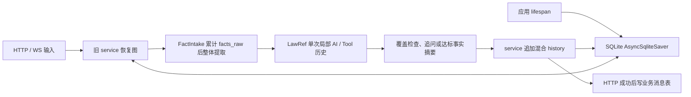

# Agent Memory 与上下文管理

本页说明原文审计、单案字段记忆、滚动摘要和调用前预算，核对日期为 2026-10-05。源码存在不能代替真实模型质量或部署验收。流程与恢复见 [工作流](../workflow.md)，接口权限见 [API](../api.md)，检索配置见 [全量检索](../knowledge/full_law_retrieval.md)。

## 为什么改造与实施前后架构

实施前应用已经由 lifespan 注入 SQLite `AsyncSqliteSaver`，能够按已知 workflow ID 恢复图状态；独立构造 orchestrator 才默认使用进程内 `MemorySaver`。问题是执行状态持久化与调用上下文管理没有分工：FactDigger 每次提取重发累计的 `facts_raw`，达标事实摘要也读取累计陈述；LawRef 在单次研究内累积 AI/Tool 历史。其他节点主要使用结构化事实，不能概括为所有 Agent 每轮发送全部聊天历史。

旧 `conversation_history` 混合外部对话和内部事件，HTTP 与 WS 的原文入库路径不统一。多轮输入重复提取会扩大输入、延迟和漂移风险，固定轮数或事后 usage 统计不能在调用前保证适配模型窗口。以下旧图对应 [2026-10-02 实施前分析](../history/memory/2026-10-02-analysis.md)，不是当前实现。

当前将完整原文与活跃上下文分开，先审计外部命令，再以本轮候选增量合并字段。案件字段、近期消息和滚动摘要由 checkpoint 保存，Gateway 在供应商调用前统一检查预算。原文完整保存不表示每次调用完整发送，`raw != active context`。

```mermaid
flowchart LR
    client["HTTP / WS 共用 process_message"] --> raw["业务 SQLite 完整原文与稳定 ID"]
    raw --> receipt["checkpoint prepared / running 回执"]
    receipt --> intake["FactIntake 本轮提取与严格校验"]
    intake --> caseMemory["CaseMemory 增量字段与冲突版本"]
    caseMemory --> nodes["LawRef / 覆盖 / 风险 / 服务节点"]
    nodes --> context["ContextBuilder 任务输入与完整工具组预算"]
    context --> model["Gateway 供应商 LLM"]
    model --> nodes
    nodes --> reply["checkpoint applied 与业务回复审计"]
    reply --> summary["可选增量 summary / 有界 recent"]
    summary --> saver["lifespan SQLite AsyncSqliteSaver"]
    caseMemory --> saver
    saver --> background["后续调用读取派生背景"]
    background --> context
```

FactIntake 的提取也经过 ContextBuilder/Gateway，但该任务不注入背景。图中的后台记忆边只代表后续调用可选读取；摘要发生在本轮业务回复提交后，不能倒过来作为本轮已完成提取的输入。两库间的箭头表示调用顺序，不表示共同事务。

## 四类数据的职责

| 数据 | 保存位置 | 权威与用途 |
| --- | --- | --- |
| raw transcript | 业务 SQLite `consultation_messages` | 完整外部输入、实际回复与内部审计事件；稳定 ID、单案 sequence、command_id、record_kind。不是图执行位置来源 |
| `memory.case` | LangGraph checkpoint | 单案字段、来源 ID、未核实状态和冲突/更正版本；投影成兼容 `facts_structured` |
| `memory.recent` | LangGraph checkpoint | 有界近期外部对话，以完整命令组保留；不是完整原文档案 |
| `memory.summary` | LangGraph checkpoint | 滚动摘要、through_sequence、version、status；摘要文本和覆盖游标一同提交 |

checkpoint 是唯一执行权威，包含真实 state 与 pending node。Redis、原文日志和进程内活动缓存不能替代它。`facts_raw` 是有界的脱敏近期陈述，`conversation_history` 是兼容投影；不能据此声称每个 checkpoint 累计完整 raw transcript。

原文审计不以知情同意为前提；派生近期上下文和摘要刷新要求 `consent_given is True`。每个案件沿现有 owner、consultation ID 与 workflow ID 隔离，没有同用户跨案件共享记忆或 semantic retrieval memory。

短期记忆指有界 `recent` 和本次工具循环历史，用于延续当前任务；后者是局部变量，不作为完整工具对话持久化。单案长期记忆指跨轮并随 checkpoint 持久保存的 `case` 和 `summary`，它们的“长期”仅限同一案件，不包括人格画像、跨案偏好或用户长期知识库。完整 raw 是审计档案，按单案 sequence 读取新增段，不是模型上下文的直接同义词。

checkpoint 解决“图执行到哪里、下一节点是什么”；memory 解决“下一次模型调用需要哪些案件背景”。memory 是 state 的一部分，不能从摘要或业务消息表推断 pending node，也不能从 Redis 投影恢复图。`CaseMemory.version` 当前初始化为 1，不按每次合并递增；实际更新和争议历史记录在字段/条目的时间、来源及 alternatives 中，不能把它当成 summary 的递增版本号。

## 外部命令与原文

HTTP/WS 共用 `service.process_message`。传输入口未传数据库会话时，服务创建 `AsyncSessionLocal`；持有同会话进程内锁后重读 checkpoint，再进入 `coordinator.process_external`。原文先提交业务 SQLite，然后记录 checkpoint 消息回执并执行图，最后提交实际回复。稳定消息 ID 与载荷指纹允许同键重放或拒绝冲突。

消息按 `external` 与 `internal` 区分；内部错误事件不进入摘要，实际返回给用户的错误响应可作为外部记录。同意与生命周期相关外部载荷也有相应审计入口；旧消息缺失的原文、轮次或确认状态不会被凭空补出。

### 一次多轮调用如何走到模型

以已同意且在 `fact_intake` 等待的案件继续发送 HTTP 或 WS 消息为例，实际顺序为：

1. 路由进入 `service.process_message`，取得同 session 进程内锁并重读 checkpoint；`process_external` 以稳定 input/reply/command ID 核验重放与载荷指纹。
2. `append_record` 保存本轮完整输入并提交业务库，再将 checkpoint 回执写为 `prepared`、`running`，`resume_workflow` 带入 `current_input/current_message_id`。
3. `fact_intake_node` 检查高风险并脱敏；`_extract_structured_facts` → Gateway `_bounded_messages` → ContextBuilder 的 `fact_intake` 任务 → 供应商 LLM。只提取本轮，FactArtifact 校验后 `merge_case_memory` 更新 case，并投影 `facts_structured`。
4. 图继续 LawRef、覆盖检查或相应后续节点。它们以本节点任务请求调用 ContextBuilder/Gateway/LLM；使用进入该调用时已保存或当前 state 中的背景，尚未生成本轮结束摘要。
5. 图到等待/人工节点，保存执行状态及 `applied` 回执；实际回复提交业务库。`refresh_optional_memory` → `memory_rows` → `advance_summary` 按需调用独立摘要 LLM。
6. `persist_state` 保存 summary、recent 与原 case，摘要文本和游标一同成为 checkpoint 权威；清回执并返回。下一轮进入其他任务时，ContextBuilder 才可能将新摘要、case、recent 加入模型背景。

2026-10-04 的真实多轮宿主走过注册/登录、HTTP/WS、真实 service、图、两 SQLite、事实提取和摘要；法律检索、覆盖节点及法律索引 preflight 是确定性替身。第 4 步完整生产法律链的质量没有由该实验证明，参见 [阶段3记录](phase3-verification.md#真实请求经过的路径)。

## 事实摄取与字段合并

`fact_intake_node` 对本轮输入先检测高风险、脱敏，再仅从本轮候选输入提取并校验 FactArtifact；ContextBuilder 的 fact_intake 任务不加入旧摘要、案件字段或近期记忆。没有新陈述且已有 case memory 时直接返回，不以旧输入重新提取。兼容旧状态时可使用最后一条旧陈述，旧字段以 `legacy_unverified` 导入。

`merge_case_memory` 的字段语义：

| FactArtifact / CaseMemory 字段 | 类型 | 保存内容 |
| --- | --- | --- |
| `incident_time`、`incident_location` | `str` 或 null | 事件时间、脱敏地点陈述 |
| `parties` | 对象列表 | 当事人陈述，提取 prompt 指引 role/name/relationship |
| `behavior_sequence` | 对象列表 | 行为事件，prompt 指引 time/actor/action/method/target |
| `consequence`、`arrest_status` | `str` 或 null | 后果、当前羁押状态陈述 |
| `evidence_mentioned` | 对象列表 | 用户提到的证据线索，非证据真实性认定 |
| `surrender`、`victim_forgiveness`、`prior_record` | `bool` 或 null | 自首、谅解、前科陈述；false 是明确否认，null 是未提及 |

这十个字段由 [FactArtifact](../../backend/app/consultation/schemas/artifacts.py) 严格校验顶层类型和额外字段；列表内是 `dict[str, Any]`，不代表完整实体或事件 schema 已校验。标量 entry 保存 `value/source_ids/updated_at/status/alternatives`；列表 entry 保存 `items/status/updated_at`，每个 item 有自己的值、来源、时间和状态，发生争议时保存 alternatives。外部来源是原文稳定消息 ID，旧字段来源是 `legacy`，无外部 ID 的内部提取用候选文本哈希生成 `internal:` ID。

- 空值不删除已有字段；相同值合并来源 ID。
- 标量新值与旧值冲突时保留 alternatives，并标记 `conflicted`，不会自动证明哪一个为真。
- 列表先按 JSON 精确值去重（对象键排序），再按身份关联：parties 使用 id/name，behavior_sequence 使用 id/event_id，evidence_mentioned 使用 id/evidence_id/name。只取首个非空身份字段；同名不等于同一人，没有语义消歧，无法识别身份的条目仍可能分开保留。
- 输入包含“更正”“纠正”“之前说错”时启用更正合并，旧版本及来源保留，新版本标为 `user_corrected_unverified`。这是当前字符串门禁，不能保证理解所有自然语言更正或撤回。
- `facts_structured` 是 case memory 的兼容投影；覆盖率、模型 confidence 或字段存在不等于律师确认。

提取失败保留上一轮有效字段；核心 typed LLM 异常仍按既有错误/重试契约处理。本轮成功消费才清除一次性输入，避免异常重试重复追加。

新增值默认 `user_claim_unverified`，旧导入值为 `legacy_unverified`。无更正门禁的标量冲突保持旧主值并新增候选版本；明确更正切换主值且保留旧版本。列表争议应读 item 状态，不能只看父字段 status。空值与空列表不删除事实，显式撤回或复杂时间变化尚无通用表达。纯脱敏占位符仅在标量值上被忽略；列表对象仍可能保存占位符。既有脱敏还可能误伤正常词语，例如历史试跑的“行程记录”，这些规则不构成错误记忆已被消除的证明。

## 按任务装配上下文

ContextBuilder 当前仅对 `fact_intake` 作特殊背景排除；其他任务共用相同的背景选择规则，差异来自节点构造的 system/current 和工具/schema，并没有实现按每个节点分别检索字段的策略。

| 任务 | 必要输入 | 可选背景与局部历史 |
| --- | --- | --- |
| `fact_intake` | 本轮脱敏陈述、提取 prompt、FactArtifact schema 或事实工具 schema | 不加入旧 case、summary、recent |
| `fact_digger` 覆盖后追问/事实摘要 | 结构化事实与缺失要件，或结构化事实与有界 facts_raw | 统一背景；给用户看的达标事实摘要与滚动 memory summary 是不同产物 |
| `law_ref` | 脱敏事实、研究任务、工具或响应 schema | 统一背景及本次研究的 AI/Tool observation；native 最终阶段使用自己的纠偏历史 |
| `risk_assessor` | 结构化事实、法条候选、风险任务 | 统一背景，不从 raw 档案全量加载 |
| `service_planner` | facts/laws/risk 和报告任务 | 统一背景；节点不再另外拼旧 history 最后五项 |
| 可选 `summary` | 旧摘要、新增外部消息段、摘要指令 | `node_context("summary", None)`，不再注入 case/recent；独立预算和超时 |

装配顺序是 system → 可装入的摘要 → 可装入的 case → 按完整命令组选择的近期背景 → 当前任务 → 可装入的完整工具历史。先预留 history 的最新完整消息组；该组是 AI tool call 时必须连同全部 observation，是普通纠偏消息时则预留该消息。可选摘要、case 各作为整条背景尝试，随后从新到旧选择 recent/history 组。预算不足可能舍弃整份 case，不是对每个字段进行价值评分。案情背景标明未核实或不可信，且调用前再次脱敏；这不能保证模型免于提示注入或事实错误。

RAG 检索结果在 LawRef 工具 observation 中随 AI tool call 成组，依据 tool_call_id 校验完整性。只删除完整旧组，保留必要最新组；孤立 ToolMessage、缺失/重复关联 ID 或最新组超预算会明确拒绝。LawRef 另外将已读取条文和要件放入当前任务证据，避免旧工具组淘汰后失去已读依据；这部分也必须适配必要输入预算。完整 observation 是当前局部研究输入，不是跨案记忆检索；`law_research` 持久化的是审计概要。部分知识库 HyDE/文档摘要直接使用 chain，不能把 Gateway 的边界宣称为项目所有模型调用都已受同一预算治理。

## 配置与预算

默认值来自 `MemorySettings.from_env()`，单位为保守估算值，并非实际 tokenizer 计数。

| 环境变量 | 默认 | 用途 |
| --- | ---: | --- |
| `MEMORY_RECENT_MESSAGES` | 8 | 近期消息目标条数，按完整命令组选择，至少保留最新完整组；极长组可从派生 recent 排除 |
| `MEMORY_CONTEXT_TOKEN_BUDGET` | 24000 | 每次模型输入估算上限 |
| `MEMORY_MODEL_WINDOW` | 32768 | 部署声明的模型窗口 |
| `MEMORY_OUTPUT_RESERVE` | 2048 | 输出预留；输入上限取预算与窗口减预留的较小值 |
| `MEMORY_SUMMARY_INPUT_BUDGET` | 6000 | 摘要指令、旧摘要、新增段与协议开销的独立输入预算 |
| `MEMORY_SUMMARY_OUTPUT_BUDGET` | 1000 | 摘要输出估算上限 |
| `MEMORY_SUMMARY_TIMEOUT_SECONDS` | 20 | 可选摘要总超时 |

`estimate_tokens` 按 UTF-8 字节数加 16 的协议余量估算；中文字节数会明显高于常见 tokenizer token 数，不能将该数与供应商 actual usage 混用。配置值必须为正，模型窗口必须大于输出预留；部署者仍需按实际模型核对窗口。

Gateway 的文本、结构化与工具调用经 ContextBuilder 装配输入，估算包括 system、当前任务、工具/schema、背景记忆和工具历史。本轮必要输入及历史最新完整消息组必须适配；超预算抛出明确错误，不静默截断用户尾部或拆散 tool call/observation。可选背景与旧历史按完整组舍弃；tool call ID 关联不完整也被拒绝。上下文预算与进程内 session call/token budget 是不同约束。

## 增量滚动摘要

`memory_rows` 分页读取 cursor 后的待摘要段和有界 recent，不每轮读取完整原文。`advance_summary` 只选择 `through_sequence` 之后、近期窗口之前的新增外部消息，按完整命令组装入预算；旧摘要和指令也占预算。

触发条件是已同意且存在退出 recent 窗口的、尚未覆盖的外部消息，不是每 N 轮或达到某个模型 usage 才触发。短对话没有 batch 时不调用摘要。分页最多读取 33 条旧段，页尾可能半组时移除该命令，下次从原游标继续；另读取 recent 目标加 2 条作为组边界余量。一次刷新只处理能装入预算的一个 batch，不保证一次就覆盖全部积压。

摘要候选合法、非空且未超过输出预算后，更新文本与 cursor/version；checkpoint 保存成功才成为派生权威。摘要失败不推进旧 cursor，保留有界 recent；无法放入首个完整组时标记 `blocked_large_message`。失败不会退回发送无限原文，也不撤销已成功的消息命令。

`through_sequence` 是已摘要段末尾的原文序号，成功后下一次从该序号之后继续；内部事件被过滤，不能把游标范围内的每个序号都称为已摘要的外部文本。摘要版本只随成功候选递增，保存失败时权威 checkpoint 仍是旧版本。近期组过大时可整组退出 recent，但 raw 保留；若该组也无法进入摘要预算，就出现派生上下文暂未覆盖的内容，应查 raw 并人工核验，不能宣称压缩后所有信息都可被模型回忆。

当前摘要使用一次 attempt、有限总超时，Ollama 单次 `reasoning=False`；输出生成限额按摘要输出预算换算，返回文本仍按保守估算复核。该开关不改变共享模型或其他供应商。摘要是不可信背景，可能遗漏或漂移；调用前会标明未核实并脱敏。

## 就绪状态与有限日志

`GET /ready` 保留 HTTP 200 和原有 `status`、`api`、`dependencies.reranker`、checkpoint 持久化字段。新增 `dependencies.raw_transcript` 和 checkpoint 的 `initialized`、`available`、`status`：未初始化和关闭均不可用；原文数据库或 checkpoint 连接探测失败时，整体 `status` 与 `api` 为 `not_ready`。必要存储可用而可选重排序器不可用时，整体为 `degraded`，`api` 仍为 `ready`。调用方必须检查 JSON 状态，不能只依据 HTTP 200 判断就绪。

两项存储探测并行执行，各有 0.5 秒上限，包含 checkpoint 锁等待。原文探测复用初始化时已使用的 SQLite 驱动连接，checkpoint 探测复用 saver 的连接和锁；仅执行 `SELECT 1`，不签出新连接、不创建数据库、不读取原文或枚举 checkpoint、不调用模型。只返回固定 `timeout` 或 `query_failed`，不返回路径、主机或原始异常。取消不会遗留请求任务或游标；SQLite 工作线程已经排队的只读操作可能在取消后完成。初始化连接失效会保守报告不可用，不通过 readiness 自动重连或修复。

`memory.summary` 报告启用状态、同意前提、输入/输出预算和超时；`memory.structured_case` 报告字段记忆已启用；`memory.context` 报告近期消息目标、输入预算、模型窗口及输出预留。预算采用上文的保守估算单位。`dependencies.checkpoint.restart_recovery` 复用 orchestrator 的持久化配置能力；`restart_recovery_scope=single_worker_normal_restart` 指已有单 worker 正常重启证据边界，`recovery_verified_now=false` 明确本请求没有执行恢复验证。关闭时撤销持久化声明；进程内 MemorySaver 不声明跨重启恢复。

`Memory.Summary` 的 `summary_event` 包括 `skipped`、`blocked`、`failed`、`generated`、`saved` 和 `projection_failed`。事件仅记录压缩条数、前后游标、版本、耗时及固定错误类别；不记录正文、摘要文本、字段值、会话 ID、凭据或原始异常。`generated` 仅表示候选通过校验；只有 `persist_state` 返回成功且摘要游标推进才记录 `saved`。生成或候选校验失败保留旧游标，不阻断已完成的外部命令；投影失败报告旧的权威游标/版本，无法确定尝试条数时写 `batch_count=unknown`。未同意的 skipped 事件也取已有摘要的真实游标与版本，不重读原文或调用模型。核心必要 LLM 的 typed 错误契约保持原样。

`Agent.FactDigger` 在首次和已有案件记忆的候选 schema 校验失败时，都记录固定 `case_candidate_event=rejected`、`error_code=schema_validation_failed` 和校验错误数量。事件复用校验结果，不记录字段名、字段值或 validation 异常；无效候选仍保留原有记忆，必要提取调用抛出的 typed LLM 错误仍向上传播。

## 恢复与失败边界

- FastAPI lifespan 注入 SQLite `AsyncSqliteSaver`；独立构造 orchestrator 默认是进程内 MemorySaver。保存同一 checkpoint、业务库并持有原 workflow ID，才具备恢复基础。
- `message_audit` 的 `prepared` 可继续执行；已持久确认的 `applied` 回执只补写回复审计，不再次 resume。已记录回复可返回原结果。
- 崩溃留下 `running` 且结果不明，或原文存在但没有明确回执时，保守停止并要求人工核验 checkpoint；两套 SQLite 没有原子事务，不能声称所有崩溃窗口自动修复。
- 同 session 锁、内部/生命周期结果 registry、trace 和会话预算仍在进程内。外部持久回执不等于跨进程锁或 exactly-once。
- 已知 ID 恢复与发现旧会话不同：活跃 `/sessions` 列表读取进程内缓存，不自动枚举旧 checkpoint。业务历史返回可空 `workflow_session_id`，映射存在时可提供恢复 ID，旧记录可能没有。
- lifecycle 的 `repair_required` 保留独立契约，相同 action 修复审计；待完成消息会阻断冲突生命周期操作。参见 [命令一致性](../architecture.md#生命周期命令先推进图再提交审计)。

当前定向测试与跨进程探针不能外推真实模型多轮质量、全部崩溃窗口、多 worker 或生产稳定性。[阶段3交付记录](phase3-verification.md) 保留隔离宿主真实 fact/summary、法律和 preflight 替身、固定合成样例及单 worker 正常停启的证据。长样例输入减少、短样例增加，回忆延迟没有改善；不能据此宣称总体成本或延迟下降。就绪探测与有限日志的验证使用隔离 SQLite、真实图和确定性模型替身，不构成新的真实模型或恢复质量证据。验证入口见 [testing](../testing.md#memory-与-full-检索契约) 与 [evaluation](../evaluation.md)。

## 验证证据与 token 对照

阶段3主线程于 2026-10-04 独立验收功能范围，公开评测程序与原运行、主线程复跑/重评分 JSON 随提交 `15bbade` 保存，验收状态说明由 `528aa2d` 更正；本页文档补全没有重新运行模型或后端回归。以下保留 [原 safe-merge 运行 JSON](../../evaluation/evidence/memory_live_2026-10-04.json) 的数字：固定短案件 1 轮、recent=8；固定长案件 6 轮、recent=2。每个场景每种上下文只有 1 次同题回忆调用，共 4 次对照；另有 17 次服务内调用，共 21 次。模型为 Qwen3.5 9B / Q4_K_M，两个输入使用相同问题和模型设置，完整历史与 active 都脱敏。

| 场景 / 输入 | 保守输入估算 | 供应商实际输入 tokens | 回忆耗时秒 |
| --- | ---: | ---: | ---: |
| 短 / full-history | 2463 | 498 | 4.24 |
| 短 / active-context | 3508 | 840 | 5.96 |
| 长 / full-history | 6223 | 1157 | 10.43 |
| 长 / active-context | 3644 | 788 | 11.72 |

长样例实际输入减少 `(1157 - 788) / 1157 ≈ 31.9%`，分母是同题 full-history 的供应商输入 tokens；短样例增加。保守估算包括 UTF-8 字节、消息/schema 与协议余量；供应商 usage 则是实际模型分词结果，缺失时记录 unknown/null。两者不能相除推导准确率，也不能将本对照等同于实施前 FactDigger 全历史重提的总体收益、原单输入离线 baseline 或生产流量统计。摘要另有调用成本，此小样例没有证明总体速度或成本降低。

主线程独立运行的 21 次调用为另一组证据：长 1156→754、短 494→848；长回忆耗时 11.58→13.47 秒、短 3.82→5.75 秒（同样 recent=2/8，每种上下文 1 次）。[原报告](../../evaluation/evidence/memory_parent_live_original_2026-10-04.json)唯一失败是评分器未识别答案中的“修正”；[重评分报告](../../evaluation/evidence/memory_parent_live_rescore_2026-10-04.json)读取原答案后更正该项，没有再次调用模型。两组数字分别保留，不混成新的实验或本轮重跑。

确定性契约入口包括 [字段/预算/摘要测试](../../backend/tests/consultation/test_memory.py)、[原文及持久化测试](../../backend/tests/consultation/test_memory_persistence.py)、[供应商与失败契约测试](../../backend/tests/consultation/test_memory_live_contract.py)、[日志测试](../../backend/tests/consultation/test_memory_observability.py)、[就绪探测测试](../../backend/tests/infrastructure/database/test_sqlite_readiness.py) 和 [评测测试](../../evaluation/test_memory_eval.py)。这些分别检查规则与受控恢复，不计算法律准确率。有限 memory 日志不含正文的结论仅限已核对事件，不能外推全项目日志都没有 PII。

## 取舍与后续工作

memory 层没有新增向量库：当前需求是同一案件、固定字段、按序增量摘要及近期组选择，直接读取 checkpoint/分页原文的契约较明确。项目 RAG 本身已有向量检索及混合召回；“memory 未新增向量库”不能写成“项目不用向量库”。当前 memory retrieval 是按案件 ID 读取 state、按 cursor/sequence 读取新增段，再按任务和预算选择背景，没有跨案相似度搜索或语义记忆召回。

| 选择 | 收益 | 代价与当前边界 |
| --- | --- | --- |
| raw 与 active 分离 | 审计保留完整输入，调用不必重发全部原文 | 两库非原子，需要回执；未知运行结果仍需人工核验 |
| 固定字段与确定性合并 | 来源、空值、冲突和更正可检查 | 不能表达完整事件图；精确去重没有语义消歧，case/alternatives 本身未设固定大小上限 |
| 增量有损摘要 | 减少重复压缩，游标可追踪覆盖 | 摘要可能丢信息，失败/超大组会留下积压，旧摘要越大可用 batch 空间越小 |
| UTF-8 保守预算 | 无 tokenizer 依赖，调用前明确拒绝必要超限 | 会过度估计而早拒绝；模型窗口声明仍需部署核对，背景可能整份舍弃 |
| 单 worker SQLite 与进程锁 | 当前停启恢复和串行契约可验证 | 不提供多 worker 锁、跨两库事务、crash exactly-once 或通用自动修复 |

后续工作是待验证的方向：扩大补充/否认/撤回/复杂实体样本并人工标注，分别评估提取与摘要的信息损失；改善既有脱敏误伤和列表占位符处理；研究模型专用 tokenizer 与按字段选择背景；测量 case/alternatives、原文和 checkpoint 的增长与保留策略；用故障注入覆盖两库崩溃窗口、备份恢复和并发场景。跨案语义检索只有在用途、权限与质量评估明确后再考虑。这些均不是本轮已交付能力；两库一致性及多 worker 等缺口仍按既有暂缓事项处理。

## 源码入口与历史分析

| 入口 | 关键符号与职责 |
| --- | --- |
| [main.py](../../backend/main.py) | lifespan / readiness_check，checkpoint 生命周期及就绪 JSON |
| [readiness.py](../../backend/app/infrastructure/database/readiness.py) | SQLiteReadiness，已初始化连接的限时只读探测 |
| [service.py](../../backend/app/consultation/service.py) | process_message / process_consent / execute_lifecycle_command，外部入口与串行 |
| [coordinator.py](../../backend/app/consultation/memory/coordinator.py) | process_external / refresh_memory，消息回执与摘要投影 |
| [transcript.py](../../backend/app/consultation/memory/transcript.py) | append_record / memory_rows，原文追加与分页 |
| [case.py](../../backend/app/consultation/memory/case.py) | merge_case_memory / project_facts，字段来源和冲突 |
| [context.py](../../backend/app/consultation/memory/context.py) | MemorySettings / ContextBuilder / recent_rows，完整组与预算 |
| [summary.py](../../backend/app/consultation/memory/summary.py) | advance_summary，增量摘要和游标 |
| [fact_digger.py](../../backend/app/consultation/agents/fact_digger.py) | fact_intake_node，本轮候选摄取 |
| [gateway.py](../../backend/app/infrastructure/llm/gateway.py) | _bounded_messages / generate / generate_with_tools，message_history 工具历史与实际调用装配 |

[2026-10-02 实施前分析](../history/memory/2026-10-02-analysis.md) 保留当时完整技术分析、失败风险和测试记录；其中“尚未实现”与历史输入增长探针不代表本页核对后的实现状态。
